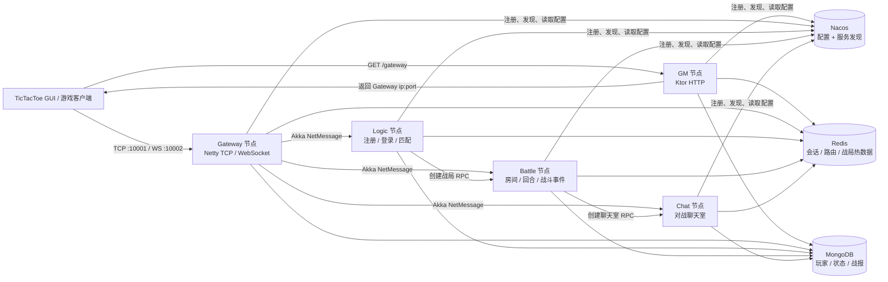

# JGameServer

JGameServer 是一个以井字棋为演示业务的分布式游戏服务器。项目已迁移为 **Kotlin + Gradle + JDK 21**：同一个 `server-all.jar` 通过启动参数运行 GM、Gateway、Logic、Battle、Chat 五类节点，节点发现与集中配置由 Nacos 提供，节点间消息通过 Akka Artery 传输。

> 当前实现中的 **GM 不是注册中心**。所有节点都直接向 Nacos 注册；GM 负责管理类 HTTP 接口，以及向客户端返回可用 Gateway 地址。

## 架构概览



### 运行时边界

- **GM**：提供 `GET /gateway`、GM 登录和命令接口。它从 Nacos 查询健康 Gateway，目前按最小节点 ID 返回连接地址。
- **Gateway**：唯一的客户端长连接入口，支持 TCP 与 WebSocket；为每个连接分配 Redis sessionId，并通过会话 Actor 完成鉴权检查、协议分区和消息转发。
- **Logic**：处理注册、登录、在线状态和匹配。主 Logic 额外创建注册与匹配 Actor；普通登录请求可路由到任意 Logic。
- **Battle**：以“一场对战一个 Actor”的方式串行处理准备、落子、认输和战斗事件，并维护 Battle 到节点的路由关系。
- **Chat**：以“一场对战一个聊天室 Actor”的方式处理加入房间和对战聊天。
- **Nacos**：同时承担配置中心和服务目录。节点把类型、ID、Akka 地址及公开端口写入实例元数据，调用方按 `NodeKind + nodeId` 解析并缓存远端 ActorRef。
- **Redis**：保存 session、玩家与节点的路由映射、匹配/战局过程数据和事件序列等短生命周期状态。
- **MongoDB**：保存 GM 用户、玩家、玩家状态和战报等持久化数据；`counters` 集合负责生成自增 ID。

### 一次请求如何流转

1. 客户端请求 GM 的 `/gateway`，取得一个健康 Gateway 的 TCP 地址。
2. 客户端建立长连接；Gateway 创建 `ClientSession`、会话 Actor 与响应 Actor，并在 Redis 中登记 session 路由。
3. Gateway 根据 `msgId` 号段校验登录/对战状态，再把 `NetMessage` 转发到 Logic、Battle 或 Chat。
4. 跨节点消息由 Akka Artery 传输。业务节点回复 Gateway 的响应 Actor，响应 Actor 将消息写回原 Netty Channel。
5. 匹配成功后，Logic 选择 Battle 节点创建战局；Battle 再选择 Chat 节点创建对应聊天室。战局与节点的绑定保存在 Redis 中，后续请求据此定向路由。

## 模块说明

| 模块 | 职责 | 主要依赖 |
| --- | --- | --- |
| `server` | 唯一可执行入口；解析 `--kind` / `--id`，组装单一 fat jar | 所有服务模块 |
| `game-common` | Protobuf 生成、消息模型、Akka/协程封装，以及 Nacos、Ktor、Mongo、Redis 等基础设施封装 | 基础模块 |
| `game-db` | MongoDB 实体与业务持久化服务、Redis key 与状态操作 | `game-common` |
| `game-gm-server` | GM HTTP、默认管理员初始化、Gateway 地址发现 | `game-common`、`game-db` |
| `game-gateway-server` | TCP/WS 接入、连接会话、鉴权与消息路由 | `game-common`、`game-db` |
| `game-logic-server` | 注册、登录、匹配与在线玩家管理 | `game-common`、`game-db` |
| `game-battle-server` | 对战房间、回合状态、游戏规则与事件 | `game-common`、`game-db` |
| `game-chat-server` | 对战聊天室与聊天广播 | `game-common`、`game-db` |
| `TicTacToe-GUI` | 仓库内置的 Swing 测试客户端；启动时先访问 GM，再连接 Gateway | `game-common` |

所有业务模块都应用 `buildSrc` 中的 `java-conventions`，统一使用 JDK 21 toolchain、Kotlin 编译选项和 JUnit Platform。客户端/服务端协议的权威来源位于 `game-common/src/main/proto/`，构建时由 Protobuf Gradle 插件自动生成代码。

## 技术栈

| 类别 | 实现 |
| --- | --- |
| 语言与构建 | JDK 21、Kotlin 2.3.0、Gradle 9.2.0 Kotlin DSL |
| 客户端接入 | Netty 4.1，TCP + WebSocket |
| 节点通信 | Akka 2.6 Classic Actor + Artery TCP，自定义消息序列化 |
| 异步模型 | Kotlin Coroutines；Actor 内按消息顺序串行执行挂起处理器 |
| HTTP | Ktor 3.3 |
| 服务发现与配置 | Nacos 3.1 |
| 数据存储 | MongoDB Kotlin Coroutine Driver 5.5、Lettuce Redis Client 6.4 |
| 协议 | Protobuf 4.33 |

## 快速开始

### 环境要求

- JDK 21；建议让 `JAVA_HOME` 指向本机 JDK 21。
- Docker Desktop 或兼容的 Docker Engine，且支持 `docker compose`。
- Windows 可直接使用 `start-server.bat`；Linux/macOS 使用下方等价命令。

构建脚本声明了 JDK 21 toolchain，并允许 Gradle 自动下载缺失的 toolchain，不再依赖开发者机器上的固定 JDK 安装路径。

### Windows 一键启动

```powershell
git clone https://github.com/132982jianan/JGameServer.git
cd JGameServer
.\start-server.bat
```

脚本会依次执行：

1. `:server:shadowJar`，生成 `server/build/libs/server-all.jar`；
2. 检查 Docker 与 Compose；
3. 拉取缺失的基础镜像；
4. 重建并启动 Nacos、MongoDB、Redis 和五类服务器节点；
5. 输出容器状态。

### Linux / macOS

```bash
./gradlew :server:shadowJar
docker compose --env-file deploy/.env -f deploy/docker-compose.yml up -d
```

查看状态与日志：

```bash
docker compose --env-file deploy/.env -f deploy/docker-compose.yml ps
docker compose --env-file deploy/.env -f deploy/docker-compose.yml logs -f
```

停止服务：

```bash
docker compose --env-file deploy/.env -f deploy/docker-compose.yml down
```

Compose 使用 `deploy/data/` 保存 Nacos、MongoDB 和 Redis 数据，日志写入 `deploy/logs/`。执行 `down` 不会删除这些目录中的数据。

### 默认端口

| 服务 | 宿主机地址 | 说明 |
| --- | --- | --- |
| GM HTTP | `http://127.0.0.1:8080` | 容器内监听 80 |
| Gateway TCP | `127.0.0.1:10001` | GUI 默认使用的游戏连接 |
| Gateway WebSocket | `ws://127.0.0.1:10002/websocket` | WebSocket 游戏连接 |
| Gateway Artery | `127.0.0.1:10000` | 节点间通信 |
| Logic Artery | `127.0.0.1:30000` | 节点间通信 |
| Battle Artery | `127.0.0.1:40000` | 节点间通信 |
| Chat Artery | `127.0.0.1:50000` | 节点间通信 |
| GM Artery | `127.0.0.1:20000` | GM 的 ActorSystem 端口 |
| Nacos API | `http://127.0.0.1:8848` | 注册与配置 API |
| Nacos 控制台 | `http://127.0.0.1:38080` | Nacos 3 控制台 |
| MongoDB | `127.0.0.1:27017` | 默认数据库 `jgame_server` |
| Redis | `127.0.0.1:6379` | 默认无密码 |

健康检查：

```powershell
Invoke-RestMethod http://127.0.0.1:8080/gateway
```

正常情况下会返回 `127.0.0.1:10001`。

### 启动测试客户端

服务器启动后执行：

```powershell
.\gradlew.bat :TicTacToe-GUI:run
```

GUI 默认访问 `127.0.0.1:8080` 的 GM 服务。可通过环境变量覆盖：

```powershell
$env:GM_HOST = "192.168.1.10"
$env:GM_PORT = "8080"
.\gradlew.bat :TicTacToe-GUI:run
```

## 单进程手动启动

先准备可访问的 Nacos、MongoDB 和 Redis，然后构建一次 fat jar：

```powershell
.\gradlew.bat :server:shadowJar
```

在五个终端分别启动节点：

```powershell
java -jar server/build/libs/server-all.jar --kind=gm
java -jar server/build/libs/server-all.jar --kind=logic --id=1
java -jar server/build/libs/server-all.jar --kind=battle --id=1
java -jar server/build/libs/server-all.jar --kind=chat --id=1
java -jar server/build/libs/server-all.jar --kind=gateway --id=1
```

`--id` 可省略；省略时节点会使用当前同类型最大 ID 加一。实际端口计算规则为：

```text
actualPort = basePort + PORT_OFFSET + nodeId - 1
```

本机直接运行时，GM 默认监听 80，而 Compose 将容器内 80 映射为宿主机 8080。如需同机启动多组节点，可设置不同的 `PORT_OFFSET`，并确保外部端口和 Gateway 下发地址同步调整。

## 配置模型

默认配置位于 `game-common/src/main/resources/conf/`：

| 文件 | 用途 | 加载方式 |
| --- | --- | --- |
| `nacos.yml` | Nacos 地址、namespace、group | 只从外置文件或 classpath 加载 |
| `net.yml` | 各节点端口、IP 解析、端口偏移、Akka 日志级别 | Nacos 优先 |
| `app.yml` | 心跳、主 Logic 标记、Gateway 对外连接地址 | Nacos 优先 |
| `mongo.yml` | MongoDB 连接与数据库名 | Nacos 优先 |
| `redis.yml` | Redis 地址、端口、密码 | Nacos 优先 |

除 `nacos.yml` 外，配置按以下顺序加载：

```text
Nacos 配置 -> 外置 ../conf 或 conf -> classpath 默认配置
```

Nacos 中不存在某项配置时，节点会读取本地默认值并自动发布到 Nacos。当前 `AppConfig` 与 `NetConfig` 在进程启动时加载并缓存，因此修改 Nacos 配置后应重启相关节点。

连接地址可用环境变量覆盖：

| 环境变量 | 作用 |
| --- | --- |
| `NACOS_HOST` | Nacos 主机，默认 `127.0.0.1` |
| `MONGO_HOST` / `MONGO_URI` / `MONGO_DB` | MongoDB 主机、完整 URI、数据库名 |
| `REDIS_HOST` | Redis 主机 |
| `PRIVATE_IP` | Akka Artery 注册与监听地址 |
| `PORT_OFFSET` | 同机多节点端口偏移 |

Compose 已将前三类主机变量注入为容器服务名。镜像版本可在 `deploy/.env` 中覆盖。

Gateway 经 `/gateway` 下发的地址当前直接取自 `app.yml` 的 `gatewayConnectPath`；部署到非本机环境时必须把它改成客户端实际可访问的地址。

## 协议与路由

TCP 消息使用大端序 12 字节消息头：

```text
packetLength (int32) | msgId (int32) | errorCode (int32) | protobuf body (bytes)
```

- `packetLength`：包含消息头在内的完整包长；Gateway 解码器处理粘包与拆包。
- `msgId`：协议号，定义在 `game-common/src/main/proto/rpc.proto`。
- `errorCode`：业务错误码；请求通常为 0，响应由服务端填写。
- `body`：对应协议的 Protobuf 二进制数据。
- TCP 心跳是裸字符串 `hb_request`，不使用上述帧格式。

Gateway 按协议号段路由：

| 号段 | 分区 | 前置条件 | 目标 |
| --- | --- | --- | --- |
| `100..109` | AUTH | 未登录 | 注册到主 Logic，登录到任意 Logic |
| `110..199` | LOGIC | 已登录 | 主 Logic |
| `6000..6999` | BATTLE | 已登录且在对战中 | 当前战局所在 Battle |
| `10001..14000` | CHAT | 已登录且在对战中 | 当前战局所在 Chat |

服务器推送使用 `20001+` 号段，客户端不能主动发送。WebSocket 复用相同的 `NetMessage` 结构，以二进制帧承载。

## GM HTTP

| 接口 | 说明 |
| --- | --- |
| `GET /gateway` | 返回一个健康 Gateway 的 `ip:port`，无可用节点时返回空文本 |
| `GET /gm/gmUserLogin?gmUserName=&passwordMD5=` | GM 登录，成功后设置有效期两小时的 `token` Cookie |
| `GET /gm/executeGmCmd` | 当前仅返回成功，命令执行逻辑尚未实现 |

首次启动 GM 时会在 MongoDB 中创建默认用户 `admin`，密码摘要为大写的 `MD5("admin")`。该默认凭据仅适合本地演示。

## 构建与测试

```powershell
# 编译并运行全部测试
.\gradlew.bat test

# 构建统一服务端 fat jar
.\gradlew.bat :server:shadowJar

# 查看全部子项目
.\gradlew.bat projects
```

主要产物：

```text
server/build/libs/server-all.jar
```

## 当前限制

- GM 命令接口仍是占位实现，没有后台管理 Web UI。
- Gateway 发现、部分节点路由采用“最低 ID”或随机选择，不是基于实时负载的调度。
- 主 Logic 标记来自共享 `app.yml`；多 Logic 部署时需要确保只有预期节点承担主 Logic 职责。
- 配置对象尚未统一接入热更新监听，修改 Nacos 配置后需要重启节点。
- 演示账号体系使用 MD5 摘要，客户端协议与节点间通信未提供生产级加密和鉴权。

因此，本项目更适合作为分布式游戏服务器的架构示例和开发基线；用于生产环境前需要补齐安全、可观测性、负载均衡与故障恢复策略。
