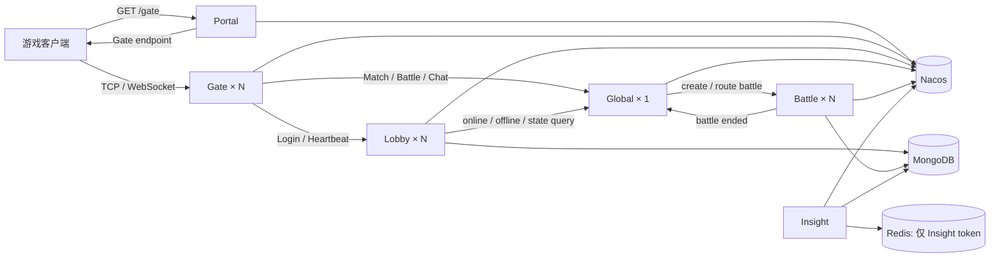

# JGameServer

JGameServer 是一个以井字棋 1v1 为演示业务的分布式游戏服务器，使用 Kotlin、JDK 21、Akka Classic、Nacos 和 MongoDB。项目架构、Actor/Entity 命名和登录流程尽量对齐 `E:\work\server\code`，Actor 运行时由自研框架替换为 Akka。

项目明确不使用 Akka Cluster Sharding，也不依赖 Akka Cluster。服务扩容采用相同 `NodeKind`、不同 `NodeId` 的多个进程；Nacos 负责节点发现，Akka Remote 负责跨进程 Actor 通信。

所有节点在 `CommonStart` 中统一订阅 `NodeKind.entries` 的全部类型（包括自身类型），持续维护健康且已启用的节点目录。新增 `NodeKind` 后无需修改各 `XxxStart` 的订阅列表；各节点可通过 `ClusterService.tell/askAwait(kind, nodeId, msg)` 寻址并发送消息，具体业务消息仍需目标 Actor 注册处理器。Portal/Insight 当前使用 `NoopNodeActor`，收到业务消息只记日志。

## 当前架构



| NodeKind | 实际职责 |
| --- | --- |
| `portal` | 只从 Nacos 选择健康 Gate，通过 `GET /gate` 返回连接地址 |
| `gate` | 持有客户端长连接；每连接一个 `GateActor + GateActorState`；选择 Lobby 并转发协议 |
| `lobby` | `AccountActor`、`PlayerActor` 与玩家私有业务；拥有 `DbAccount`、`DbPlayer` |
| `global` | 首版单实例；拥有匹配池、在线摘要、玩家战局目录、聊天参与者和房间 |
| `battle` | 一场战斗一个 `BaseBattleActor + BattleActorState`，持有权威棋盘和回合状态 |
| `insight` | 独立管理面；当前提供简化登录与 GM 命令接口 |

Portal 不认证、不创建账号、不签票据。Gate 不加载 Account/Player。Lobby 不负责跨玩家匹配。Global 不加载完整 DbPlayer，也不持久化在线、匹配和战局路由。

## ActorId + ActorState 在 Akka 中的实现

参考工程的概念在本项目中映射为：

| `code` 概念 | Akka 实现 |
| --- | --- |
| ActorId | 领域主键 + 节点内 ActorRef 目录；Akka path 使用安全化名称 |
| ActorState | Actor 内部独占的 data class/字段，只由该 Actor 串行修改 |
| 跨节点定位 | `NodeKind + NodeId` 经 Nacos 找到节点根 Actor |
| 同步式 RPC | `ActorRef.askAwait(...)`，代码顺序执行、协程挂起不阻塞线程 |
| Actor 定时器 | 每个 Actor 继承 `timer(duration) { ... }`，到期后回调排队串行执行 |

当前主要映射：

- LobbyRootActor：Lobby 固定根；`LobbyRootActorState` 保存 AccountId/PlayerId 到 ActorRef 的本地目录。
- GateActor：连接 Channel ID；状态为 Channel、sessionId、AccountId、PlayerId、LobbyId。
- AccountActor：AccountId；状态为 DbAccount、GateActorRef、PlayerActorRef。
- PlayerActor：PlayerId；状态绑定唯一 DbPlayer 和保存心跳。
- ChatActor：PlayerId；状态保存该玩家当前 GateActorRef。
- RoomActor：BattleId；状态保存允许成员和已加入成员。
- BaseBattleActor：BattleId；状态保存玩家、棋盘、回合、事件、准备集合和 GateActorRef。

为了区分上下行，Netty 入站包装为 `GateClientMsg`，业务节点回包仍是 `NetMessage`，两者由同一个 GateActor 处理。项目没有 `GateResponseActor`、`ClientSession` 或 `ClientSessionManagerService`。

### Actor 定时器

参考 code 的 `Actor.timer` / `ActorTimer` 和 `ActorManager.serve` 的自动注册方式，`BaseMessageActor` 内置 `timer(1.seconds) { ... }` 并自动注册 `ActorTimer.process`，所有业务 Actor 自动继承。计时协程只负责向自身投递消息，挂起回调通过普通处理器分发表在 Actor 的消息循环中执行，可以直接读写 ActorState，无需业务额外注册处理器或创建 CoroutineScope。`CoroutineActor` 只负责串行消费，不判断定时消息类型。

计时 scope 和调度线程池由所有 Actor 共享，每个 Actor 仅保留任务取消句柄，调用 `timer` 时才创建计时协程。消息串行性来自唯一的消费协程顺序调用处理器：处理器挂起时也不会开始下一条消息；`limitedParallelism(1)` 本身不能阻止多个协程在挂起点交错执行。

`timer` 返回的 `Job` 与 code 一样，只代表等待和投递：`cancel()` 可以取消尚未投递的任务，Job 完成不代表回调已经执行。Actor 停止或重启时自动取消旧实例的待触发定时器，跳过旧实例尚未执行的定时请求；已经开始的回调按当前消息执行完毕。循环业务在回调末尾重新调用 `timer`。`MatchActor` 已使用该方式，启动后立即检查匹配，随后每轮完成后间隔 1 秒再次检查，异常后仍继续调度，避免慢请求期间堆积 tick。

## 登录流程

客户端使用无密码 LoginDebug：

```text
LoginName = trim(客户端输入)
AccountId = "LoginDebug_" + LoginName
```

1. 客户端调用 Portal `/gate`，连接返回的 Gate。
2. Gate 建立连接时创建 GateActor，按 AccountId 对健康 Lobby 做稳定哈希。
3. LobbyRootActor 按 AccountId 定位 AccountActor。
4. 账号不存在时创建 DbAccount，并分配唯一 PlayerId；不存在独立注册步骤。
5. AccountActor 请求 LobbyRootActor 按 PlayerId 取得或创建同级 PlayerActor；PlayerActor 加载 DbPlayer，不存在时仅在内存中创建。
6. PlayerActor 使用 `askAwait(GlobalRootActor)` 查询玩家是否仍在某场 Battle，并把返回的 UserState 放入登录响应。
7. GateActor 绑定 PlayerId 并把 LoginResponse 写回自己的 Netty Channel。

Account 和 Player 是两个模型：DbAccount 表示登录身份与账号占有；DbPlayer 是角色聚合根，未来背包、任务等玩家私有业务都放在 PlayerActor/DbPlayer 下。游戏没有区服，一个账号当前只绑定一个角色。

同账号再次登录遵循参考工程行为：旧连接被踢，新连接本次也返回 `LoginErrorAlreadyLogin` 并关闭；客户端再次连接登录后成功。跨 Lobby 占有使用 DbAccount 的 `lobbyId + loginTimestamp` CAS 保护。

## 匹配、战斗与聊天

- Gate 将 Match/CancelMatch 直接发给 Global 的 MatchActor。
- MatchActorState 只在内存保存等待队列和玩家 GateActorRef；匹配状态不写 Redis/Mongo。
- 匹配成功后 Global 选择 Battle 节点，创建一场 BaseBattleActor。
- Global 的 BattleManagerActorState 保存 `PlayerId -> BattleId + Battle NodeId`，同时让 RoomManagerActor 创建同 BattleId 的 RoomActor。
- Gate 的战斗请求先发 Global；BattleManagerActor 查内存目录后把消息转发给正确 Battle，并保留原 GateActor sender。
- BattleActorState 保存棋盘、当前回合、事件序号、准备状态等全部热状态；结束时仅把 DbBattleRecord 写入 MongoDB，然后通知 Global 清理路由和房间。
- 玩家重登录时 Lobby 通过 askAwait 查询 Global 的战局目录；无需 Redis 恢复表。
- ChatManagerActor 管理一人一个 ChatActor，RoomManagerActor 管理一房间一个 RoomActor；玩家展示名摘要也只在 Global 内存中保存。

这些运行态不做崩溃恢复。进程崩溃视为程序重大故障，应修复问题；不使用 Redis 持久化瞬时状态来掩盖一致性问题。

## 玩家数据保存

PlayerActor 独占 DbPlayer，保存机制参考 `code`：

- 新 Player 登录时不立即写 DbPlayer。
- 每条玩家消息先驱动 heartbeat；客户端登录后每 5 秒发送 Heartbeat。
- minute 分支随机间隔 60～120 秒。
- 距上次成功保存至少 5 分钟时，整体 replace/upsert DbPlayer。
- 只有 Mongo ACK 成功后推进保存时间；失败会在下一次 minute heartbeat 重试。
- 断线、顶号、PlayerActor 下线和 Lobby 正常退出时强制保存，最多三次短退避重试。

正常停服保证玩家实体保存；匹配队列、在线表、房间和战局 ActorState 不落库。

## 模块

| 模块 | 内容 |
| --- | --- |
| `common` | Protobuf、Akka/协程、Nacos、Mongo/Redis 基础设施、共享 Db 实体 |
| `portal` | Gate 分配 HTTP 服务 |
| `gate` | Netty、GateActor、GateActorState 和路由 |
| `lobby` | AccountActor、PlayerActor 和玩家业务 |
| `global` | MatchActor、BattleManagerActor、ChatManagerActor、RoomManagerActor |
| `battle` | BattleServerActor、每战局 BaseBattleActor 和规则 |
| `insight` | 简化管理 HTTP 服务 |
| `server` | 唯一服务端入口和 fat jar |
| `TicTacToe-GUI` | Swing 演示客户端 |

## JDK 21、构建与启动

所有业务模块统一使用 Java source/target/toolchain 21，Gradle Wrapper 为 9.2.0。

```powershell
.\gradlew.bat clean build
.\gradlew.bat :server:shadowJar
```

服务端唯一产物为 `server/build/libs/server-all.jar`，所有节点仍从 `server + 命令行参数` 启动：

```powershell
java -jar server/build/libs/server-all.jar --kind=portal --id=1
java -jar server/build/libs/server-all.jar --kind=global --id=1
java -jar server/build/libs/server-all.jar --kind=battle --id=1
java -jar server/build/libs/server-all.jar --kind=lobby --id=1
java -jar server/build/libs/server-all.jar --kind=gate --id=1
java -jar server/build/libs/server-all.jar --kind=insight --id=1
```

推荐启动顺序为 Nacos、MongoDB、Redis（仅 Insight 需要），再启动 Global、Battle、Lobby、Gate、Portal、Insight。`--id` 可省略，本地会按同类节点自动分配；部署环境建议显式指定稳定 NodeId。

本地 Docker 启动：

```powershell
.\start-server.bat --no-pause
```

| 服务 | 默认地址 |
| --- | --- |
| Portal | `http://127.0.0.1:8080/gate` |
| Gate TCP | `127.0.0.1:25001` |
| Gate WebSocket | `ws://127.0.0.1:25002/websocket` |
| Insight | `http://127.0.0.1:9000` |
| Nacos | `127.0.0.1:8848` |
| MongoDB | `127.0.0.1:27017` |
| Redis | `127.0.0.1:6379`（仅 Insight token） |

当前实现细节见 `doc/01_架构设计文档.md`；架构决策与验收基线见 `doc/02_四类节点目标架构设计评审稿.md`。
