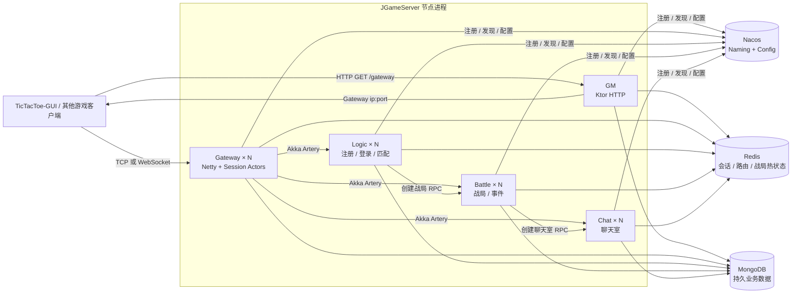
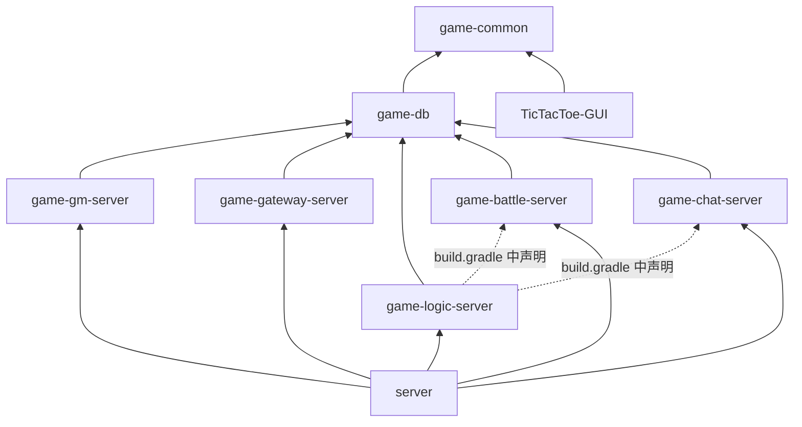
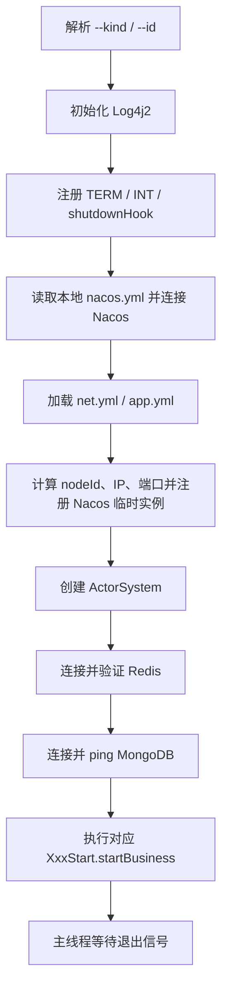
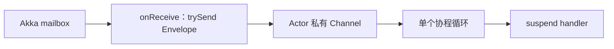
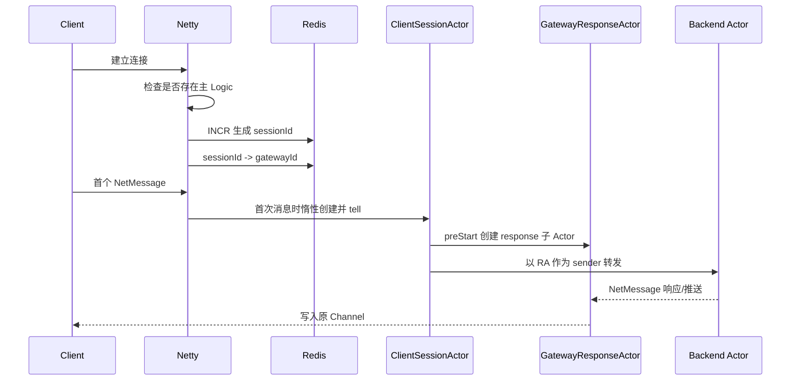
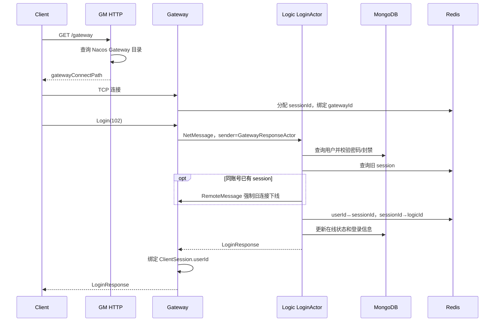
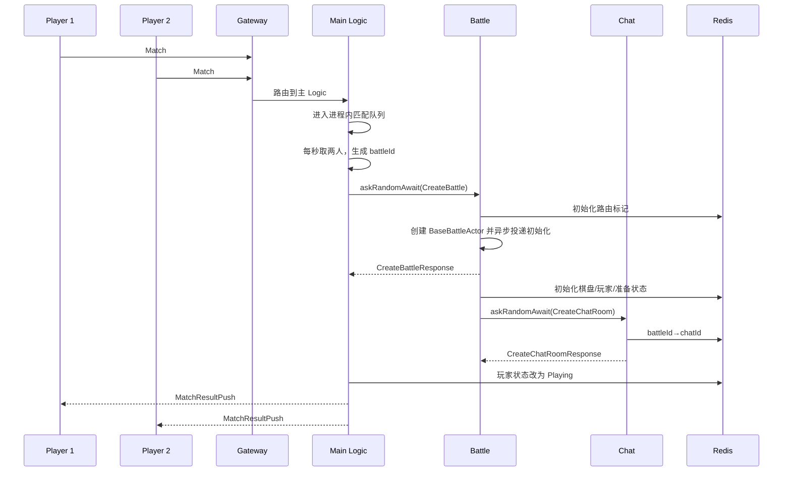
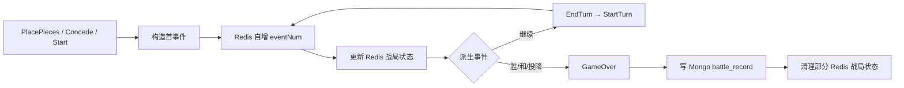

# JGameServer 架构设计文档

> 本文描述 2026-09-14 仓库代码所实现的架构，而不是迁移前的 Java/Spring Boot 版本或未来规划。若文档与代码不一致，以 `settings.gradle.kts`、各模块 `build.gradle.kts`、`server/CommonStart.kt` 和实际业务源码为准。

## 1. 文档范围

JGameServer 是一个以井字棋 1v1 对战为演示业务的分布式游戏服务器。当前版本采用 Kotlin 和 JDK 21，以多个独立 JVM 进程运行五类节点：

- GM：HTTP 管理入口和 Gateway 地址发现。
- Gateway：TCP/WebSocket 客户端接入、会话管理和消息路由。
- Logic：注册、登录、在线状态和匹配。
- Battle：战局初始化、对战指令和事件处理。
- Chat：对战聊天室和消息推送。

本文覆盖构建模块、进程拓扑、启动生命周期、通信协议、Actor 并发语义、数据归属、核心业务时序、扩容约束和已知风险。

本文不把历史类名、已删除的 Spring/JPA 结构或重构设想当作当前设计。

## 2. 统一术语

| 术语 | 本文含义 |
| --- | --- |
| 模块 | Gradle 子项目，是编译和依赖边界，不等同于运行进程 |
| 节点 | 一个带确定 `NodeKind` 和 nodeId 的运行实例 |
| 进程 | `server-all.jar` 的一次 JVM 启动；一个进程只运行一种节点 |
| 主 Logic | `isMainLogicServer=true` 的 Logic 节点，额外承担注册与匹配 |
| Session | 一条 Gateway 客户端连接的运行时身份，由 Redis 自增 sessionId 标识 |
| 玩家 | MongoDB 中的持久账号和状态，由 userId 标识 |
| 战局 | 一次井字棋对战，由 battleId 标识；过程状态主要保存在 Redis |
| 房间 Actor | 与 battleId 关联的 Actor；当前 Battle 房间 Actor 主要负责初始化，聊天房间 Actor 负责聊天 |
| 服务目录 | Nacos Naming 中的在线节点列表与元数据，不是 GM 或 Redis 注册表 |

特别说明：项目名中的 `game-gm-server` 沿用历史命名，但当前 GM **不是注册中心**。所有节点都直接注册到 Nacos。

## 3. 技术基线

| 类别 | 当前实现 | 作用 |
| --- | --- | --- |
| 语言与运行时 | Kotlin 2.3.0、JDK 21 | 服务端、客户端和构建 toolchain |
| 构建 | Gradle 9.2.0 Kotlin DSL、Shadow 9.2.2 | 多模块构建与统一 fat jar |
| 并发模型 | Akka Classic 2.6.21 + Kotlin Coroutines 1.10.2 | Actor 消息串行化、挂起式 I/O 与节点通信 |
| 客户端网络 | Netty 4.1.112 | TCP、自定义二进制协议、WebSocket 接入 |
| HTTP | Ktor 3.3.3 | GM HTTP 接口 |
| 服务发现与配置 | Nacos Client 3.1.0 | Naming、Config、节点元数据 |
| 持久化 | MongoDB Kotlin Coroutine Driver 5.5.1 | 玩家、玩家状态、GM 用户、战报 |
| 共享状态 | Lettuce 6.4 Coroutine API + Redis | 会话、路由、战局热状态 |
| 消息协议 | Protobuf 4.33.0 | 客户端、跨节点和本地消息体 |
| 日志 | Log4j2 2.24.1、kotlin-logging 7.0.3 | 节点分类日志 |

JDK 21 由 `buildSrc/src/main/kotlin/java-conventions.gradle.kts` 统一声明为 source、target 和 toolchain。`gradle.properties` 不绑定机器本地路径，并允许自动下载缺失 toolchain。Compose 节点运行时使用 `eclipse-temurin:21-jre`。

## 4. 系统上下文与部署拓扑



### 4.1 进程模型

`server` 模块生成一个 `server-all.jar`。入口 `ApplicationKt` 解析：

```text
--kind=gm|gateway|logic|battle|chat
--id=<可选节点 ID>
```

同一份 jar 由 Compose 启动五次，每次选择一种 `kind`。这是一种“单构建产物、多进程角色”的部署模式，不是把五种节点运行在一个 JVM 中。

### 4.2 默认端口

| 节点/组件 | 容器或本机监听 | Compose 暴露到宿主机 |
| --- | --- | --- |
| GM HTTP | 80 | 8080 |
| GM Artery | 20000 | 20000 |
| Gateway Artery | 10000 | 10000 |
| Gateway TCP | 10001 | 10001 |
| Gateway WebSocket | 10002，路径 `/websocket` | 10002 |
| Logic Artery | 30000 | 30000 |
| Battle Artery | 40000 | 40000 |
| Chat Artery | 50000 | 50000 |
| Nacos API/gRPC/控制台 | 8848 / 9848 / 8080 | 8848 / 9848 / 38080 |
| MongoDB | 27017 | 27017 |
| Redis | 6379 | 6379 |

节点端口不是绝对常量，实际计算为：

```text
actualPort = basePort + PORT_OFFSET + nodeId - 1
```

Compose 当前只部署每类一个 `id=1` 节点。

## 5. 工程模块与依赖

```text
JGameServer/
├── buildSrc/                  统一 Java/Kotlin/JUnit 构建约定
├── game-common/               协议、消息、Actor/协程和基础设施封装
├── game-db/                   Mongo 实体/服务与 Redis 状态操作
├── game-gm-server/            GM HTTP
├── game-gateway-server/       客户端接入与路由
├── game-logic-server/         注册、登录、匹配
├── game-battle-server/        战局与事件
├── game-chat-server/          聊天室
├── server/                    唯一服务端入口与 fat jar
├── TicTacToe-GUI/             Swing 测试客户端
└── deploy/                    Compose、镜像变量、数据和日志目录
```

### 5.1 构建依赖图



`game-logic-server` 的构建脚本目前额外声明了对 Battle 和 Chat 模块的直接依赖，但运行时通信仍走 Akka/Nacos，当前 Logic 源码没有直接导入这两个模块。这两条属于可清理的构建依赖，而不是运行时进程耦合。

### 5.2 各模块职责

| 模块 | 关键内容 |
| --- | --- |
| `game-common` | `NetMessage`、`RemoteMessage`、`LocalMessage`；Protobuf 生成；`CoroutineActor`、`BaseMessageActor`、`AkkaService`、`ClusterService`；Nacos、Mongo、Redis、Ktor 和进程退出封装 |
| `game-db` | `PlayUserEntity`、`PlayStateEntity`、`GmUserEntity`、`BattleRecordEntity`；玩家/状态/战报服务；session 与战局 Redis 操作 |
| `server` | `Application.kt` 和 `CommonStart.kt`；统一启动与退出生命周期 |
| `game-gateway-server` | Netty TCP/WS 服务、协议编解码、连接会话 Actor、Gateway 路由 |
| `game-logic-server` | `LogicServerActor`、`LoginActor`、主 Logic 的 `RegistActor` 与 `MatchActor` |
| `game-battle-server` | `BattleServerActor`、全局 `BattleActionActor`、每局 `BaseBattleActor` 和事件函数 |
| `game-chat-server` | `ChatServerActor`、每局 `BattleChatRoomActor` |
| `game-gm-server` | Ktor 路由、管理员种子数据、Gateway 查询 |

协议的唯一源码位于 `game-common/src/main/proto/`，Java/Kotlin 类在构建阶段自动生成。

## 6. 节点启动与退出生命周期

所有节点都通过 `CommonStart.start()` 执行相同基础启动序列：



基础设施任一步骤失败都会使启动返回失败并以退出码 999 结束。当前顺序先注册 Nacos，再验证 Redis/Mongo 和创建业务 Actor，因此节点可能在业务完全就绪前短暂出现在服务目录中。

退出回调按注册逆序执行，负责注销 Nacos 实例、关闭 Mongo/Redis 客户端等。Gateway 的 Netty EventLoop 已提供 `shutdown()`，但当前没有注册到统一退出回调；Akka 的 `close()` 也没有被 `CommonStart` 注册，这是优雅停机仍需补齐的部分。

## 7. 配置与服务发现

### 7.1 配置加载模型

默认配置位于 `game-common/src/main/resources/conf/`：

| 配置 | 主要内容 |
| --- | --- |
| `nacos.yml` | Nacos host、port、namespace、group |
| `net.yml` | 节点端口段、私网/公网地址策略、端口偏移、Akka 日志级别 |
| `app.yml` | socket idle、默认节点 ID、主 Logic 标记、Gateway 下发地址 |
| `redis.yml` | Redis host、port、password |
| `mongo.yml` | MongoDB connectionString、databaseName |

`nacos.yml` 是引导配置，只读外置文件或 classpath。其他配置遵循：

```text
Nacos Config -> 外置 ../conf/ 或 conf/ -> classpath conf/
```

Nacos 中没有某个 dataId 时，`ConfigLoaderService` 会读取本地默认值并发布到 Nacos。连接 Nacos 失败时不会退回本地业务配置，以避免不同节点运行在不一致配置上。

`ConfigLoaderService.listen()` 已实现监听 API，但当前业务对象使用 `load()` 或惰性单例，尚未接入监听；修改 Nacos 配置后应重启相关节点。

环境变量覆盖包括 `NACOS_HOST`、`MONGO_HOST`、`MONGO_URI`、`MONGO_DB`、`REDIS_HOST`、`PRIVATE_IP` 和 `PORT_OFFSET`。`PUBLIC_IP` 虽然在 `net.yml` 中声明，但当前 `/gateway` 下发地址直接使用 `app.yml.gatewayConnectPath`，并不会自动由 `PUBLIC_IP` 和实际 TCP 端口拼接。

### 7.2 Nacos 节点模型

每个节点注册为以 `NodeKind` 命名的 Nacos 临时实例：`gm`、`gateway`、`logic`、`battle`、`chat`。

实例地址使用 Akka Artery host/port，metadata 包括：

- `nodeId`
- `systemName`
- `actorName`
- `actorPath`
- `publicTcp`、`publicWs`、`publicHttp`（适用时）
- `connectPath`（Gateway）
- `isMainLogicServer`（Logic）

ActorSystem 名称为 `<kind>_<id>`，完整主 Actor 路径为：

```text
akka://<kind>_<id>@<host>:<arteryPort>/user/<actorName>
```

### 7.3 节点发现与 ActorRef 缓存

`NacosService` 可以订阅一种节点的变化，维护 `kind -> nodeId -> NodeInfo` 目录。节点下线时会清理对应 ActorRef 缓存。尚未订阅的类型在每次查询时通过 Nacos 同步获取健康实例。

当前订阅关系：

| 节点 | 主动订阅 |
| --- | --- |
| GM | Gateway |
| Logic | Battle、Chat |
| Battle | Chat |
| Chat | Battle |
| Gateway | 无；路由时同步查询 |

首次访问远端节点时，`actorSelection(...).resolveAwait()` 解析 ActorRef，之后按 `NodeKind + nodeId` 缓存。

### 7.4 节点 ID 与选择策略

- 显式传入 `--id` 时直接使用该 ID。
- 未传 ID 时读取同类型所有实例，并使用当前最大 ID 加一。
- GM `/gateway` 在健康且具有 `connectPath` 的 Gateway 中选择最小 nodeId。
- 普通 Logic 登录、Battle 创建和 Chat 创建使用健康节点列表中的随机实例。

这些策略不是实时负载均衡。自动 ID 的“读取最大值再加一”也不是原子操作，并发启动同类型节点时存在 ID 冲突窗口。

## 8. 消息与通信模型

### 8.1 三类消息

| 类型 | 使用范围 | 主要字段 |
| --- | --- | --- |
| `NetMessage` | 客户端与 Gateway、Gateway 与业务节点、业务节点回包/推送 | msgId、errorCode、sessionId、userId、userIp、protobuf data |
| `RemoteMessage` | 服务节点之间的控制/RPC 消息 | msgId、errorCode、protobuf data |
| `LocalMessage` | 同一 JVM 内 Actor 之间或定时任务 | msgId、`lite` 对象 |

`LocalMessage.lite` 可以直接携带 JVM 对象，不参与远程序列化。

### 8.2 客户端 TCP 帧

TCP 使用大端序整数和 12 字节消息头：

```text
packetLength:int32 | msgId:int32 | errorCode:int32 | protobuf body:bytes
```

`packetLength` 包含头部本身。`ProtocolDecoder` 使用 reader index 回滚处理 TCP 半包，并可连续解析粘包。客户端心跳是裸字符串 `hb_request`，不使用标准消息帧。

当前解码器没有对负数、低于 12 或异常大的 `packetLength` 做上限校验，生产环境需要增加帧长保护。

### 8.3 WebSocket

Gateway 在 10002 的 `/websocket` 接收二进制帧，帧内容仍是完整 `NetMessage` 二进制包；支持 Ping/Pong，不支持文本帧和 continuation frame。

当前 WebSocket pipeline 没有把服务端 `NetMessage` 编码包装为 `BinaryWebSocketFrame` 的 outbound handler，因此入站解析已经存在，响应/推送链路仍不完整。现阶段完整可用的演示链路是 TCP 10001。

### 8.4 Akka Artery 序列化

Java 原生序列化被禁用。自定义 Serializer 格式为：

```text
NetMessage:
msgId | errorCode | sessionId | userId | userIpLength | userIp | data

RemoteMessage:
msgId | errorCode | data
```

Actor 配置在代码中动态生成，并以 fat jar 内合并后的 `akka-merged.conf` 作为 fallback。

### 8.5 挂起式 RPC

`ClusterService` 对外提供：

- `tell(kind, nodeId, message)`：单向发送。
- `askAwait(kind, nodeId, message)`：向确定节点发送并挂起等待回复。
- `askRandomAwait(kind, message)`：随机选择健康节点后请求/响应。

默认 ask 和 ActorRef 解析超时均为 5 秒。实现使用 `suspendCancellableCoroutine` 桥接 Akka CompletionStage，等待期间不阻塞工作线程。

## 9. Actor 与协程并发语义

### 9.1 CoroutineActor

每个业务 Actor 仍是 Akka Classic Actor，但消息处理分为两层：



- Akka `onReceive` 只把消息和 sender 投递到私有 Channel，不执行业务 I/O。
- 一个 Actor 只有一个消费协程，因此同一 Actor 的 handler 串行执行。
- handler 等待 Mongo、Redis 或远端 ask 时会挂起，线程可服务其他 Actor。
- 默认 Channel 为 `UNLIMITED`，所以当前实际上没有有界背压；持续过载会表现为内存队列增长。
- Actor 停止时关闭 Channel，并在 `postStop()` 等待已进入 Channel 的消息处理结束。

### 9.2 显式处理器注册

`BaseMessageActor` 已删除历史版本的注解扫描和 ReflectASM 分发。子类在构造时按消息 Class 显式注册 `suspend` handler，再在 handler 内按 msgId 进行 `when` 分发。

`RpcErrorException` 会被统一转换为对应 `NetMessage` 或 `RemoteMessage` 错误响应；其他异常只记录日志，不保证向调用方返回错误包。

### 9.3 并发粒度

| 范围 | 当前串行化边界 |
| --- | --- |
| 每条 Gateway 连接 | 一个 `ClientSessionActor` 串行处理该连接请求 |
| Gateway 回包 | 每连接一个 `GatewayResponseActor` 串行写回 |
| Logic 登录 | 每个 Logic 节点只有一个 `LoginActor`，该节点全部登录串行 |
| 主 Logic 注册 | 一个 `RegistActor` |
| 主 Logic 匹配 | 一个 `MatchActor` + `MatchService` Mutex |
| Battle 客户端操作 | 每个 Battle 节点只有一个全局 `BattleActionActor`，节点内所有战局操作串行 |
| Battle 房间 Actor | 每局一个 `BaseBattleActor`，当前只接收初始化 LocalMessage |
| Chat | 每局一个 `BattleChatRoomActor`，同一房间聊天串行 |

因此，“一局一个 Battle Actor 串行处理全部对战请求”并不是当前实现。实际对战操作进入节点级 `BattleActionActor`，事件函数再根据 battleId 读写 Redis；每局 `BaseBattleActor` 主要负责初始化。

## 10. 各节点内部设计

### 10.1 GM

GM 业务启动顺序：订阅 Gateway、确保默认管理员存在、启动 Ktor。

| HTTP 接口 | 行为 |
| --- | --- |
| `GET /gateway` | 从 Nacos 读取健康 Gateway，按最小 nodeId 返回 `connectPath` |
| `GET /gm/gmUserLogin` | 校验用户名和大写 MD5，成功后写入两小时 `token` Cookie |
| `GET /gm/executeGmCmd` | 当前固定返回成功，未实现命令执行 |

首次启动会向 MongoDB `gm_user` 写入 `_id=1`、用户名 `admin` 和 `MD5("admin")`。GM 虽然通过公共启动流程创建 ActorSystem 并注册 `gmActor` 路径，但当前没有创建对应业务 Actor，也没有其他节点依赖 GM Actor。

### 10.2 Gateway

Gateway 创建一个 `GatewayNodeActor` 处理 Logic 发来的强制下线消息，同时启动 TCP 和 WebSocket Server。

连接生命周期：



`ClientSessionActor` 和 `GatewayResponseActor` 分离是关键约束：后端回包不能回到请求 Actor，否则会被当作新请求再次路由并形成循环。

Gateway 路由规则：

| msgId 号段 | 分区 | 前置条件 | 目标选择 |
| --- | --- | --- | --- |
| `100..109` | AUTH | 连接尚未登录 | Regist 到主 Logic；Login 到随机 Logic |
| `110..199` | LOGIC | 已登录 | 主 Logic |
| `6000..6999` | BATTLE | 已登录且 Redis 中存在 userId→battleId | 优先 battleId→Battle nodeId，失败时随机 Battle |
| `10001..14000` | CHAT | 已登录且在战局中 | battleId→Chat nodeId；没有随机回退 |

登录成功响应到达 `GatewayResponseActor` 时，Gateway 才把 userId 写入 `ClientSession`。未登录连接发送需登录协议时会被直接关闭。

断线时 Gateway 删除本地会话和 Redis 路由，必要时把玩家设为离线，并向该 session 所属 Logic、Battle、Chat 发送 `GatewayNoticeClientOfflinePush`。

### 10.3 Logic

每个 Logic 都创建：

- `LogicServerActor`：顶层 NetMessage/RemoteMessage 分发与离线通知。
- `LoginActor`：登录校验、顶号、会话绑定、玩家状态更新。

只有 `isMainLogicServer=true` 的 Logic 额外创建：

- `RegistActor`：校验用户名/密码，写入玩家和初始状态。
- `MatchActor`：处理匹配/取消匹配，每秒驱动一次队列配对。

匹配队列是主 Logic 进程内的 `ConcurrentLinkedQueue`，不在 Redis 中。当前只支持 `BattleTypeTwoPlayer`，每次取两名玩家并随机打乱行动顺序。

Logic 保存 `sessionId -> GatewayResponseActor` 的进程内索引，用于匹配结果等主动推送。这类 ActorRef 不是持久状态，Logic 重启后需要玩家重新建立绑定。

### 10.4 Battle

Battle 创建两个固定 Actor：

- `BattleServerActor`：接收 Logic 的创建战局 RemoteMessage，以及 Gateway 的对战 NetMessage。
- `BattleActionActor`：节点级的统一对战指令处理器。

收到创建战局请求后，`BattleRoomActorManagerService`：

1. 把 battleId 加入 Redis 进行中集合。
2. 创建名为 `battle-<battleId>` 的 `BaseBattleActor`。
3. 写入 userId→battleId 和 battleId→Battle nodeId。
4. 向房间 Actor 投递初始化 LocalMessage。
5. 立即向 Logic 回复创建成功。

房间 Actor 随后初始化参战者、九宫格、开始时间和未准备玩家集合，再同步请求一个 Chat 节点创建聊天室。需要注意：Battle 在聊天室创建完成前已经向 Logic 回复创建成功；Chat 创建失败只记录日志，不回滚战局。

客户端对战请求并不投递给房间 Actor，而是统一进入 `BattleActionActor`。它支持：

- 获取战局信息。
- 双方准备。
- 落子。
- 投降。

### 10.5 Chat

Chat 的 `ChatServerActor` 负责创建聊天室和把客户端聊天请求投递到房间 Actor。每个 battleId 对应一个 `BattleChatRoomActor`，映射只保存在当前 Chat 进程内。

`JoinChatRoom` 当前只返回成功；`BattleChatText` 根据 Redis 中的参战者列表把消息推给对手，再回复发送者。协议中的聊天 scope 被复制到推送，但当前服务端没有根据 scope 实现不同接收范围。

## 11. 核心业务时序

### 11.1 客户端接入与登录



### 11.2 匹配、战局和聊天室创建



Battle 对 Logic 的成功响应早于房间初始化和 Chat 创建，所以图中后半部分存在并发交错，而不是一个原子事务。

### 11.3 准备、落子和事件链

双方都调用 `ReadyToStartGame` 后，服务端建立第一个回合。落子请求必须满足：

- 玩家处于该战局。
- 双方已经准备。
- 当前轮到该玩家。
- 客户端 `lastEventNum` 与 Redis 一致。
- 下标在 0..8 且格子为空。

事件处理使用显式队列展开派生事件：



每个事件都会追加到 Redis 的事件列表，事件组通过 `BattleEventMsgListPush(22001)` 推送给对手；发起者从请求响应中收到相同事件组。`lastEventNum` 用于检测客户端状态是否落后。

## 12. 数据架构

### 12.1 MongoDB：持久业务数据

默认数据库为 `jgame_server`。

| 集合 | 主键 | 内容 |
| --- | --- | --- |
| `play_user` | userId | 用户名、昵称、密码 MD5、注册/登录时间与 IP |
| `play_state` | 自增 `_id`，另含 userId | 在线状态、行为状态、battleType、battleId |
| `gm_user` | GM userId | GM 用户名和密码 MD5 |
| `battle_record` | 自增 `_id` | battleId、参战者、起止时间、回合、胜者、结束原因 |
| `counters` | 集合名 | `MongoSequence` 使用原子自增生成业务 ID |

当前没有数据库级事务把玩家与初始 `play_state`、战局结束状态与战报归档组合成一个原子提交。

### 12.2 Redis：共享运行时状态

| 数据类别 | 主要 Key/模式 | 数据结构 |
| --- | --- | --- |
| Session 自增 | `sessionIdAutoIncrease` | String counter |
| 用户会话 | `userIdToSessionId`、`sessionIdToUserId` | Hash |
| Session 节点路由 | `sessionIdToGatewayId`、`sessionIdToLogicServerId` | Hash |
| 玩家战局路由 | `battleUserIdToBattleId` | Hash |
| 战局节点路由 | `battleIdToBattleServerId`、`battleIdToChatServerId` | Hash |
| 进行中战局 | `battlePlayingBattleIds:<battleType>` | Set |
| 参战者 | `battleUserIds:<battleId>` | List |
| 九宫格 | `battleCellInfo:<battleId>` | List |
| 当前回合 | `battleCurrentTurnInfo` | Hash，value 为 Base64 Protobuf |
| 事件与编号 | `battleEventList:<battleId>`、`battleLastEventNum` | List + Hash |
| 准备/时间 | `battleNotReadyUserIds:<battleId>`、`battleStartTimestamp` | Set + Hash |
| GM token | `gmUserToken:<token>` | String，TTL 7200 秒 |

`RKeys` 仍保留历史负载均衡 key 常量，但当前节点注册、Akka path 和健康状态不再写 Redis，而由 Nacos 管理。

### 12.3 进程内状态

以下状态不具备进程重启恢复能力：

- 主 Logic 的匹配队列。
- Logic 的 sessionId→GatewayResponseActor。
- Battle 的 battleId→BaseBattleActor 和 sessionId→GatewayResponseActor。
- Chat 的 battleId→ChatRoomActor 和 sessionId→GatewayResponseActor。
- Gateway 的 Channel、ClientSession 和 sessionId→Channel。

Redis 中保存的是标识和业务状态，不能序列化或恢复远端 ActorRef 与 Netty Channel。

## 13. 故障行为与扩容约束

### 13.1 已实现行为

- Nacos 临时实例下线后，订阅者会更新节点目录并清除 ActorRef 缓存。
- Gateway 找不到原 Battle 节点时会随机选择另一个 Battle；由于对战指令直接基于 Redis 状态处理，部分请求可能继续执行。
- 同账号再次登录时，Logic 根据 Redis 中的旧 session 路由通知对应 Gateway 强制下线。
- 客户端断线会触发 session 清理，并通知关联的 Logic/Battle/Chat。
- 进程收到 TERM/INT 时会执行已注册的基础设施清理回调。

### 13.2 不能保证的行为

- 主 Logic 的匹配队列没有复制；主 Logic 重启会丢失排队玩家，而 Mongo 状态可能仍为 Matching。
- Chat 房间只在内存中创建；Chat 重启后 Redis 路由仍可能指向新进程中不存在的房间，且 Gateway Chat 路由没有随机回退。
- Logic/Battle/Chat 重启后进程内 GatewayResponseActor 索引丢失，主动推送可能失败，直到相关请求重新绑定。
- Battle 回退到其他节点时不会更新 battleId→Battle nodeId；多个 Battle 间也没有每战局锁，连续请求可能被随机落到不同节点。
- 创建战局、初始化 Redis、创建聊天室和修改玩家状态不是事务，任一步失败都可能留下部分状态。

### 13.3 多实例注意事项

- 主 Logic 按共享 `app.yml.isMainLogicServer` 决定。若所有 Logic 共享同一份配置，它们都会被标成主节点；当前设计缺少按实例覆盖的主节点选举。
- `gatewayConnectPath` 是共享静态字符串，不会自动结合 nodeId、`PUBLIC_IP` 或端口偏移生成；多 Gateway 必须分别提供可访问地址才能正确下发。
- nodeId 自动分配不是原子的；并发扩容建议显式指定唯一 ID。
- 每个节点都经公共启动流程连接 Nacos、Redis、Mongo，即使某个节点只使用其中一部分能力。

## 14. 已知代码风险

以下内容是根据当前代码行为记录的技术债，不是已实现能力：

1. **Battle 清理顺序错误**：`doGameOver()` 先清空 `battleUserIds`，随后 `removeBattle()` 再读取参战者并删除 `battleUserIdToBattleId`，此时列表已经为空，玩家到 battleId 的映射可能残留。
2. **Battle Actor 生命周期不完整**：`removeBattle()` 只从内存 Map 移除 ActorRef，没有调用 `context.stop`，已结束战局的 Actor 仍可能留在 ActorSystem 中。
3. **匹配失败状态不回滚**：Battle 创建失败时会推送失败结果，但已从队列取出的玩家状态没有恢复为 `ActionNone`。
4. **战局创建过早确认**：Battle 在房间初始化及 Chat 创建完成前回复 Logic 成功，可能出现客户端收到匹配成功但聊天室未就绪。
5. **WebSocket 下行未闭环**：缺少 `NetMessage -> BinaryWebSocketFrame` 出站编码。
6. **无界 Actor 队列**：默认 `Channel.UNLIMITED`，高负载下没有内存保护。
7. **协议长度缺少防御**：TCP/WS 解码未限制 `packetLength` 合法范围和最大包长。
8. **启动就绪窗口**：节点在 Redis、Mongo 和业务 Actor 就绪前已注册为 Nacos 健康实例。
9. **退出清理不完整**：ActorSystem 和 Gateway Netty EventLoop 未接入统一关闭回调。
10. **安全基线仅适合演示**：注册请求传明文密码，存储和登录使用无盐 MD5；外部协议、GM 接口和 Artery 没有生产级认证与加密。
11. **断线映射删除参数错误**：用户真正离线时调用了 `removeOneSessionIdToUserId(userId)`，没有删除 `userIdToSessionId`，可能使旧 session 持续影响顶号和推送路由。
12. **战局/聊天室缺少完整回收**：结束战局时没有删除 battleId→Chat nodeId、事件列表和 Chat 房间 Actor；是否保留事件需要明确生命周期策略，其余映射会形成陈旧路由。

## 15. 可观测性

- `Application.kt` 在日志系统初始化前按 `kind` 设置 `logDir`。
- Log4j2 默认写入 `logs/<kind>/`；Compose 把各节点日志统一挂载到 `deploy/logs/`。
- 关键路径已经记录节点注册、目录变化、消息转发、session 绑定、匹配和战局初始化日志。
- 当前没有统一 metrics、trace、健康检查 HTTP 或业务 readiness 探针。
- Compose 对 Nacos、MongoDB、Redis 配置了 healthcheck，但五类 Java 节点没有 healthcheck。

## 16. 构建、部署与验证

### 16.1 构建产物

```powershell
.\gradlew.bat test :server:shadowJar
```

产物：

```text
server/build/libs/server-all.jar
```

Shadow 构建会合并依赖中的 Typesafe `reference.conf`，输出 `akka-merged.conf`，合并 `META-INF/services`，并排除签名文件和冲突的 Log4j 插件缓存。

### 16.2 Compose 启动

```powershell
.\start-server.bat
```

或：

```powershell
.\gradlew.bat :server:shadowJar
docker compose --env-file deploy/.env -f deploy/docker-compose.yml up -d
```

Compose 先等待 Nacos、MongoDB、Redis 健康，再启动五类节点。Java 节点只依赖 GM `service_started`，节点间真正的可用性仍由 Nacos 和业务代码判断。

### 16.3 手动启动

```powershell
java -jar server/build/libs/server-all.jar --kind=gm
java -jar server/build/libs/server-all.jar --kind=logic --id=1
java -jar server/build/libs/server-all.jar --kind=battle --id=1
java -jar server/build/libs/server-all.jar --kind=chat --id=1
java -jar server/build/libs/server-all.jar --kind=gateway --id=1
```

本机直接运行时 GM 监听 80；宿主机 8080 是 Compose 端口映射，不是应用配置端口。

## 17. 源码导航

| 主题 | 入口文件 |
| --- | --- |
| 统一 main | `server/src/main/kotlin/com/jacey/game/server/Application.kt` |
| 公共启动序列 | `server/src/main/kotlin/com/jacey/game/server/CommonStart.kt` |
| Actor/协程桥接 | `game-common/src/main/kotlin/com/jacey/game/common/framework/akka/CoroutineActor.kt` |
| 显式消息分发 | `game-common/src/main/kotlin/com/jacey/game/common/akka/BaseMessageActor.kt` |
| Nacos 目录 | `game-common/src/main/kotlin/com/jacey/game/common/framework/net/NacosService.kt` |
| 配置加载 | `game-common/src/main/kotlin/com/jacey/game/common/framework/nacos/ConfigLoaderService.kt` |
| 客户端消息协议 | `game-common/src/main/kotlin/com/jacey/game/common/msg/NetMessage.kt` |
| Protobuf | `game-common/src/main/proto/` |
| Gateway 路由 | `game-gateway-server/src/main/kotlin/com/jacey/game/gateway/actor/ClientSessionActor.kt` |
| Gateway 节点选择 | `game-gateway-server/src/main/kotlin/com/jacey/game/gateway/service/MessageRouterService.kt` |
| 登录 | `game-logic-server/src/main/kotlin/com/jacey/game/logic/actor/LoginActor.kt` |
| 匹配 | `game-logic-server/src/main/kotlin/com/jacey/game/logic/service/MatchService.kt` |
| 对战指令 | `game-battle-server/src/main/kotlin/com/jacey/game/battle/actor/BattleActionActor.kt` |
| 战局事件 | `game-battle-server/src/main/kotlin/com/jacey/game/battle/actor/BaseBattleActor.kt` |
| 聊天 | `game-chat-server/src/main/kotlin/com/jacey/game/chat/actor/ChatServerActor.kt` |
| Redis 状态 | `game-db/src/main/kotlin/com/jacey/game/db/service/BattleInfoService.kt` |
| Compose | `deploy/docker-compose.yml` |

## 18. 架构结论

当前 JGameServer 的核心架构可以概括为：

```text
统一 fat jar、多角色 JVM
        +
Nacos 服务目录和集中配置
        +
Netty 客户端接入
        +
Akka Remote 外壳与协程串行处理
        +
Redis 共享运行时状态
        +
MongoDB 持久业务数据
```

这套实现已经完成从 Spring Boot/Java 8/Redis 注册表到 Kotlin/JDK 21/Nacos 的主体迁移，并具备完整的 TCP 演示链路。当前最需要优先收敛的是战局状态清理、主 Logic 高可用、ActorRef 重绑定、WebSocket 下行、启动 readiness 和有界背压；这些问题直接决定多实例和故障场景下的正确性。
