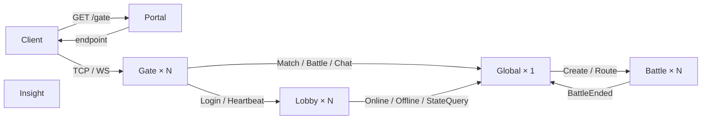
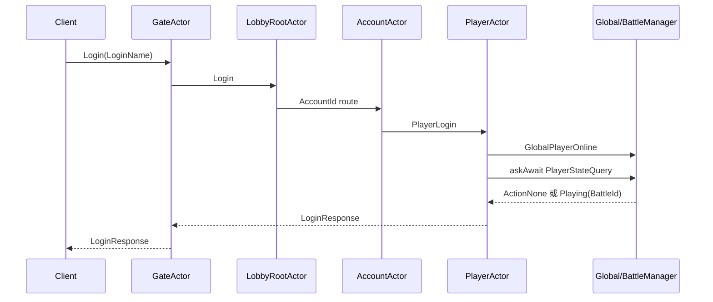

# JGameServer 目标架构设计评审稿（Gate / 内存运行态版）

> 状态：v2.0，已按后续评审意见实施。
>
> 文件名保留“四类节点”是为了兼容原评审链接；当前实际运行节点为 Portal、Gate、Lobby、Global、Battle、Insight 六类。

## 1. 已确认的强约束

1. Portal 只分配 Gate，不认证、不创建账号、不签票据。
2. Gate 持有客户端长连接，每连接一个 GateActor。
3. Lobby 只处理 Account、Player 生命周期和玩家身上的业务。
4. 匹配涉及多个玩家，MatchActor 必须在 Global，不放多实例 Lobby。
5. Global 首版单实例，拥有匹配、在线摘要、战局目录、ChatActor 和 RoomActor。
6. Battle 一场战斗一个 Actor，权威热状态归该 Actor。
7. Insight 是独立管理面，不与 Portal 混合。
8. 无区服；Account 与 Player 分离；一个 Account 当前绑定一个 Player。
9. LoginDebug 只输入 LoginName，无密码；缺失 Account/Player 自动创建。
10. 同账号再登录时旧连接和本次新连接都断开，客户端重试。
11. Actor 使用 Akka Classic/Remote，永远不使用 Akka Cluster Sharding。
12. 扩容使用 NodeKind + NodeId + Nacos。
13. 所有进程由同一个 `server-all.jar --kind --id` 启动。
14. DbPlayer 按参考 code 用消息心跳延迟保存；首次登录不立即落地。
15. 不考虑进程崩溃恢复。崩溃视为重大程序问题，不为瞬时状态设计 Redis 恢复。

## 2. 最终拓扑



所有节点注册 Nacos。Lobby/Battle/Insight 访问 Mongo；只有 Insight 使用 Redis token TTL。Portal、Gate、Global 不连接数据库或 Redis。

## 3. 为什么 MatchActor 在 Global

Lobby 可横向扩容，而一个匹配池必须看见跨 Lobby 的所有候选玩家。若 MatchActor 放 Lobby，需要主 Lobby 选举、队列转发或分布式队列，都会增加不必要的一致性成本。

Global 首版单实例，因此 MatchActorState 可以直接保存：

```text
twoPlayerQueue: ArrayDeque<MatchPlayer>
matchingPlayerIds: Set<PlayerId>
```

MatchPlayer 只含 PlayerId 和本次连接 GateActorRef。加入、取消和配对都在 MatchActor 的串行消息循环中完成，不需要 Mutex、Redis 或 Mongo。

## 4. GateActor 设计结论

参考 code 没有 GateResponseActor，因此 Akka 版也不保留它。区分消息来源的方式不是增加子 Actor，而是使用不同消息类型：

```text
客户端上行：GateClientMsg(NetMessage)
服务端下行：NetMessage
```

同一 GateActor 同时处理上下行。GateActorState 直接持有：

- Netty Channel；
- sessionId；
- AccountId；
- PlayerId；
- Lobby NodeId。

Netty Channel attribute 仅保存 GateActorRef。`ClientSession`、`ClientSessionManagerService`、Session Redis 映射均不需要，已经删除。

## 5. ActorId + ActorState 的 Akka 写法

自研框架和 Akka 的核心语义可以一一对应：

| 自研 Actor | Akka 版 |
| --- | --- |
| ActorId | 领域 ID；由节点根 Actor 的内存 Map 定位 ActorRef |
| ActorState | Actor 私有 data class/字段 |
| serve/register | `registerHandler` + Props 创建 |
| post/call | `tell` / `askAwait` |
| NodeKind/NodeId | Nacos 节点目录 + 固定根 Actor path |

不为了模拟框架 API 创建额外 ManagerService。以下目录确有必要，并由管理 Actor 自己持有：

- LobbyRootActorState 的 AccountId/PlayerId→ActorRef 目录；
- Global BattleManagerActor 的 PlayerId→BattleLocation；
- Global ChatManagerActor 的 PlayerId→ChatActor；
- Global RoomManagerActor 的 BattleId/PlayerId→RoomActor；
- BattleServerActor 的 BattleId/PlayerId→BaseBattleActor。

## 6. Lobby

```text
LobbyRootActor
  ├── AccountActor(AccountId)
  └── PlayerActor(PlayerId)
```

AccountActor 与 PlayerActor 是 LobbyRootActor 的同级子 Actor。AccountActor 通过 `askAwait` 请求根 Actor 按 PlayerId 取得或创建 PlayerActor。LobbyRootActor 是唯一注册表，ActorRef 目录保存在 LobbyRootActorState，并通过 watch/Terminated 清理；不再保留 LobbyActorManagerService。

AccountActor 立即保存 DbAccount，因为 AccountId 唯一性、Lobby 占有和 PlayerId 绑定需要稳定记录。PlayerActor 独占 DbPlayer；未来背包等玩家级模块只加入 PlayerActor/DbPlayer。

Lobby 不包含 MatchActor、房间目录或 Battle 路由。

## 7. Global

```text
GlobalRootActor
├── MatchActor + MatchActorState
├── BattleManagerActor + BattleManagerActorState
├── ChatManagerActor
│   └── ChatActor(PlayerId)
└── RoomManagerActor
    └── RoomActor(BattleId)
```

BattleManagerActorState 是唯一跨节点战局目录：

```text
PlayerId -> BattleId + Battle NodeId
BattleId -> PlayerIds
```

Gate 将战斗协议发给 Global，Global 查表后转给正确 Battle。玩家断线只让 Battle 删除旧 GateActorRef，不删除 BattleLocation；玩家重登录时 PlayerActor 使用 `askAwait(GlobalRootActor)` 查询 UserState，可直接恢复 Playing/BattleId。

ChatManagerActor 在内存保存在线展示名摘要和 ChatActor，不再使用 playerSummary Redis。RoomManagerActor/RoomActor 在内存保存聊天室目录和成员。

## 8. Battle

BattleServerActor 是节点根 Actor和 ActorId 目录：

```text
BattleId -> BaseBattleActorRef
PlayerId -> BaseBattleActorRef
```

每个 BaseBattleActor 的 BattleActorState 包含棋盘、当前回合、eventNum、事件列表、未准备玩家和 GateActorRef。客户端指令直接路由到对应 BaseBattleActor，不再经过全局 BattleActionActor，也不再使用 BattleRoomActorManagerService 或 BattleInfo Redis。

正常结束时：

1. 写 DbBattleRecord；
2. 向双方 GateActor 推送/回包；
3. 通知 BattleServerActor 清本地目录并停止子 Actor；
4. BattleServerActor 通知 Global 清 BattleLocation 和 RoomActor。

## 9. 登录、重登录和顶号



同账号顶号：旧 Gate 收 ForceOffline，新 Gate 收 LoginErrorAlreadyLogin；AccountActor/PlayerActor 清理并强制保存，新客户端下一次连接登录成功。若玩家原本在战斗中，Global 的 BattleLocation 仍存在，下一次登录通过 askAwait 恢复。

## 10. 持久化决策

| 数据 | 位置 | 是否持久化 |
| --- | --- | --- |
| DbAccount | AccountActor/Mongo | 是，立即 |
| DbPlayer | PlayerActor/Mongo | 是，心跳延迟 |
| DbBattleRecord | Mongo | 是，战斗结束 |
| Insight token | Redis | TTL |
| 在线摘要 | Global ChatManagerActorState | 否 |
| 匹配队列 | Global MatchActorState | 否 |
| Player→Battle 路由 | Global BattleManagerActorState | 否 |
| Room/成员 | Global Room ActorState | 否 |
| 棋盘/回合/事件 | BattleActorState | 否 |

`DbPlayerState`、Session Redis、playerSummary Redis、BattleInfo Redis 均已取消，避免异常退出后的脏在线/脏战局。

## 11. DbPlayer 保存

- 首次创建不立即写 DbPlayer。
- 玩家消息驱动 heartbeat。
- minute 分支随机 60～120 秒。
- 成功保存冷却为 5 分钟。
- 整文档 replace/upsert。
- Mongo ACK 后才更新时间；失败后重试。
- 正常断线、顶号、下线、Lobby 退出强制保存。

此保证只针对正常生命周期，不承诺进程崩溃恢复。

## 12. 模块和启动

```text
common | portal | gate | lobby | global | battle | insight | server | TicTacToe-GUI
```

```powershell
.\gradlew.bat clean build
.\gradlew.bat :server:shadowJar
java -jar server/build/libs/server-all.jar --kind=<portal|gate|lobby|global|battle|insight> --id=<NodeId>
```

JDK source/target/toolchain 均为 21。部署多个 Gate/Lobby/Battle 时使用不同 NodeId；Global 首版只部署一个实例。

## 13. 当前验收清单

- [x] Portal 只分配 Gate。
- [x] 独立 Gate，连接级 GateActor/GateActorState。
- [x] 删除 GateResponseActor、ClientSession 和 ClientSessionManagerService。
- [x] LoginName 无密码自动创建 Account/Player。
- [x] AccountActor、PlayerActor 和参考式顶号。
- [x] MatchActor 移至 Global，匹配队列仅在 ActorState。
- [x] Global 内存战局目录和登录 askAwait 恢复。
- [x] ChatManagerActor/ChatActor、RoomManagerActor/RoomActor。
- [x] 每战局 BaseBattleActor/BattleActorState。
- [x] 删除 Redis 在线/匹配/路由/棋盘状态。
- [x] DbPlayer 心跳延迟保存和正常退出强制保存。
- [x] DB 封装合入 common，实体命名对齐 code。
- [x] Insight 与 Portal 分离。
- [x] JDK 21 和统一 server 命令行启动。
- [x] 不使用 Akka Cluster Sharding。
