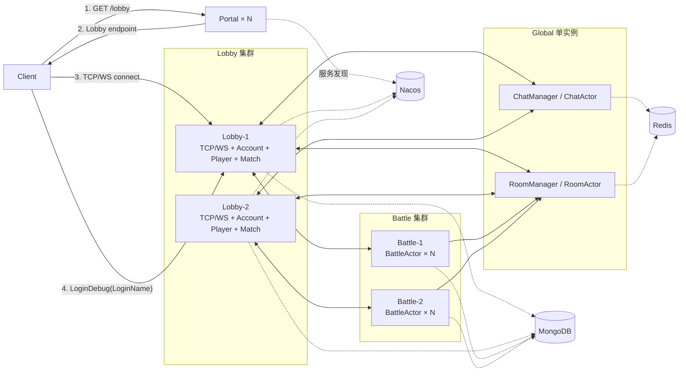
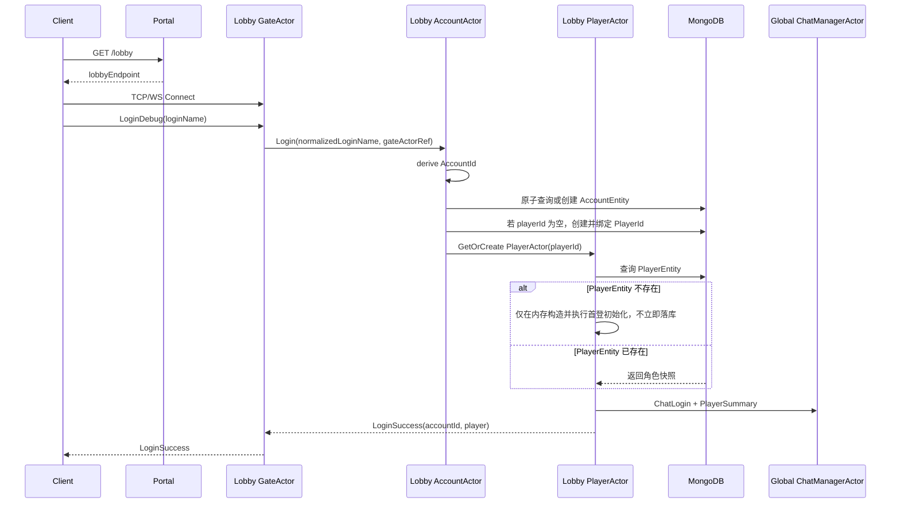
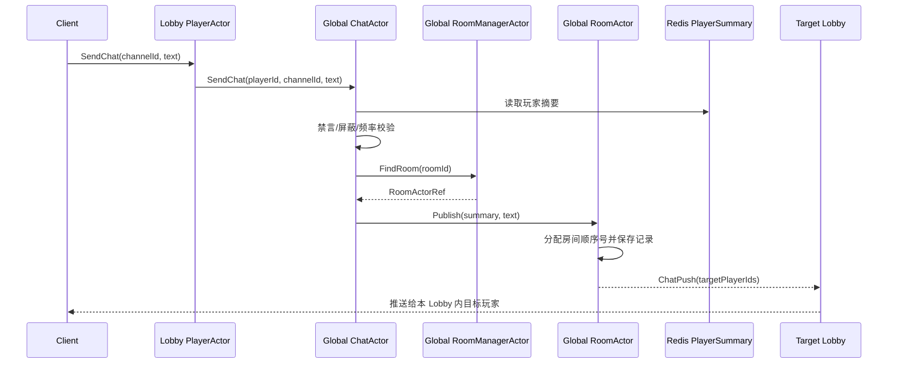

# JGameServer 四类节点目标架构设计评审稿

> 状态：Draft v0.4，供架构审核，不代表已进入编码阶段。
>
> 目标运行时：JDK 21、Kotlin、Akka、Nacos、MongoDB、Redis。
> 参考实现：`E:\work\server\code`，仅借鉴职责和流程，不照搬其自研 Actor 框架、Gate 节点及区服模型。

本文将参考工程视为目标架构母版。除“Actor 运行时替换为 Akka、Gate 进程合入 Lobby、删除区服模型”三项必要差异外，不主动重做参考工程的领域划分。项目不使用 Akka Cluster Sharding；节点发现、扩容和跨节点寻址统一使用 Nacos、NodeKind、NodeId 与 Akka Remote。

## 1. 已确认的架构约束

本轮设计以以下结论为前提：

1. 游戏服务只有 **Portal、Lobby、Global、Battle** 四类节点，没有独立 Gate 节点。
2. Portal 职责非常简单：发现健康 Lobby、执行负载分配、返回 Lobby 的公网连接地址。
3. Portal 不接收 `LoginName`，不创建账号，不生成 `AccountId`，不签发登录票据，也不维持长连接。
4. 客户端拿到 Lobby 地址后，直接与 Lobby 建立 TCP/WebSocket 长连接。
5. 客户端向 Lobby 提交 `LoginName`，不需要密码；不存在账号时直接注册账号并自动创建角色。
6. `Account` 是账号，`Player` 是角色，两者必须是不同的领域模型和持久化实体。
7. Lobby 同时负责长连接、账号登录、角色数据和玩家级业务；未来的背包、任务等模块归 `PlayerActor`。
8. Lobby 的 Actor 设计参考 `GateActor -> AccountActor -> PlayerActor` 的职责链，但使用 Akka 实现。
9. 游戏不分区、不分服，不能把参考工程的 `Sector/Block` 模型带入本项目。
10. Global 至少包含聊天和大厅房间目录；在线聊天玩家由 `ChatManagerActor` 管理，每名在线玩家对应一个 `ChatActor`。
11. Battle 负责战斗权威状态；Lobby 和 Global 不直接修改战局内部状态。

## 2. 参考代码事实与本项目取舍

### 2.1 Portal

参考工程的 Portal 只有 `/gate` 和公告接口。`/gate` 从 Nacos 获取 Gate 列表，再按客户端 IP 哈希选择 Gate。它不接收用户名，也不创建账号。

本项目没有 Gate，因此将接口改为：

```text
GET /lobby
```

Portal 从 Nacos 中选择一个健康 Lobby，返回其 TCP/WebSocket 地址。客户端随后直接连接该 Lobby。

### 2.2 LOGIN_DEBUG

参考工程的 Debug 登录语义是：

```text
normalizedLoginName = loginName.trim()
accountId = "LoginDebug_" + normalizedLoginName
```

`AccountId` 是登录类型和登录名的确定性组合，不是数据库自增 ID。同一个规范化登录名始终得到同一个账号标识。

参考实现没有密码校验，传入的 token 实际未参与 Debug 认证。本项目沿用“无密码开发登录”语义，但应补齐以下最低输入校验：

- `trim()` 后不得为空；
- 限制 UTF-8 字节数和字符数；
- 拒绝控制字符；
- 明确大小写是否敏感；
- 保存到 `AccountEntity.loginName` 的值必须与生成 `AccountId` 的规范化值一致。

最后一条用于修正参考实现中“AccountId 使用 trim 后名字、账号文档却可能保存原始空白”的不一致。

### 2.3 账号与角色

参考工程先创建 `DbAccount`，玩家选区后才创建 `PlayerId` 和 `DbPlayer`。一个账号可以在多个区服各有一个角色，因此 `DbAccount` 使用 `playerList`。

本项目没有区服，也没有选区步骤，因此不照搬 `playerList + sectorId`：

- `AccountEntity` 保存登录身份和唯一绑定的 `playerId`；
- `PlayerEntity` 使用独立 `playerId`，反向保存 `accountId`；
- 首次账号登录成功后，Lobby 自动创建一个角色并绑定；
- 后续登录直接加载同一角色；
- 登录名和角色展示名是两个字段，即便首版显示相同，也不能在模型中合并。

### 2.4 Actor 映射

参考工程的 `GateActor` 属于独立 Gate 进程，绑定一条客户端连接。本项目虽然删除 Gate 进程，但这个连接级 Actor 的职责仍然存在。

为了让代码结构尽量贴近参考工程，本设计的结论是：**保留 `GateActor`，但把它放在 Lobby 模块中。** `GateActor` 在这里是 Actor 角色名，不代表仍有 Gate 服务器。若后续团队认为名称容易误解，再做纯命名替换，不改变职责链。

映射如下：

| 参考工程 | 本项目目标 | 说明 |
|---|---|---|
| Gate 进程 | 不存在 | 连接接入合并到 Lobby |
| `GateActor` | Lobby `GateActor` | 一条连接一个，管理协议状态和回包；不对应独立 Gate 进程 |
| `AccountActor` | Lobby `AccountActor` | 一个活动账号一个，处理登录、建号、顶号和角色绑定 |
| `PlayerActor` | Lobby `PlayerActor` | 一个在线角色一个，绑定 `PlayerEntity` 并串行处理玩家业务 |
| `DbAccount` | `AccountEntity` | 登录身份和账号生命周期 |
| `DbPlayer` | `PlayerEntity` | 角色主档和各玩家模块数据 |

### 2.5 ActorId 约定

ActorId 直接由对应领域主键派生，保持与参考工程一致的寻址思路：

| Actor | ActorId | 说明 |
|---|---|---|
| GateActor | `GateActorId(lobbyId, connectionId)` | 登录前没有 playerId；connectionId 只需在 Lobby 节点内唯一 |
| AccountActor | `AccountActorId(accountId)` | 同一账号稳定映射到同一逻辑身份 |
| PlayerActor | `PlayerActorId(playerId)` | 角色 ID 就是玩家业务 Actor 身份 |
| ChatActor | `ChatActorId(playerId)` | 与 Lobby PlayerActor 一一对应，但属于 Global Actor 域 |
| RoomActor | `RoomActorId(roomId)` | 一个聊天房间一个 Actor |
| MatchActor | `MatchActorId(matchKey)` | 按玩法或匹配池标识 |
| BattleActor | `BattleActorId(battleId)` | 一场战斗一个 Actor |

ActorId 只表达逻辑身份，不持久化 Akka ActorPath。具体节点地址由 NodeKind、NodeId 和 Actor 路由层解析，避免节点扩缩容后旧路径失效。

### 2.6 节点与 Actor 寻址约定

项目明确不使用 Akka Cluster Sharding，也不依赖 Cluster Singleton 自动迁移 Actor。统一寻址模型为：

```text
NodeKind + NodeId -> 目标服务实例
ActorId           -> 目标实例内的 Actor
Akka Remote       -> 跨节点消息传递
Nacos             -> NodeKind/NodeId 与网络地址发现
Redis/Mongo       -> 只保存确有必要的实体路由关系
```

同一类服务需要扩容时，启动多个相同 NodeKind、不同 NodeId 的实例。负载分配由上游选择节点，Actor 始终在已经选定的 NodeId 内创建和寻址。

典型路由如下：

| 目标 | NodeId 来源 | ActorId |
|---|---|---|
| Lobby GateActor | 当前客户端连接所在 Lobby | connectionId |
| Lobby AccountActor | AccountEntity.activeLobbyId；登录前为当前 Lobby | accountId |
| Lobby PlayerActor | 在线路由中的 lobbyId | playerId |
| Global ChatActor | 首版唯一 Global 的 NodeId | playerId |
| Global RoomActor | 首版唯一 Global 的 NodeId | roomId |
| BattleActor | `battleId -> battleNodeId` 路由 | battleId |

缓存的远端 ActorRef 失效时，先通过 Nacos 刷新 NodeId 地址，再重新解析 Actor；不能把旧 ActorPath 当成持久化路由。

## 3. 总体拓扑



核心链路只有两跳：

```text
Client -> Portal：只获取 Lobby 地址
Client -> Lobby：建立长连接并完成后续全部登录和游戏交互
```

Portal 不在游戏消息链路中，也不是 Lobby 的反向代理。

## 4. Portal 设计

### 4.1 职责

Portal 只负责：

- 查询 Nacos 中可接入的 Lobby；
- 过滤未就绪、维护中或正在 drain 的 Lobby；
- 按客户端 IP 哈希选择一个 Lobby；
- 返回 Lobby 的客户端连接地址；
- 在无可用 Lobby 时返回明确的重试错误。

Portal 不负责：

- 接收或保存 LoginName；
- 生成 AccountId、PlayerId 或任何账号数据；
- 签发短期票据；
- 连接鉴权；
- 保存客户端 Session；
- 转发 Lobby、Global 或 Battle 消息；
- 持有玩家在线状态。

### 4.2 HTTP 接口

建议首版接口：

```http
GET /lobby
```

成功响应示例：

```json
{
  "lobbyId": 1001,
  "tcpEndpoint": "game.example.com:19001",
  "websocketEndpoint": "wss://game.example.com/ws",
  "protocolVersion": 1
}
```

响应中没有账号、密码或 ticket。Lobby 不能信任客户端回传的 `lobbyId`，实际节点身份以当前连接所在进程为准。

### 4.3 Lobby 选择

首版直接沿用参考 Portal 的分配思想，只把目标从 Gate 改成 Lobby：

1. 从 Nacos 读取健康且允许接入的 Lobby；
2. 按 `nodeId + endpoint` 稳定排序；
3. 使用客户端 IP 的稳定哈希对 Lobby 数量取模；
4. 返回选中 Lobby 的连接地址；
5. 没有可用 Lobby 时返回“服务暂不可用”。

这是一种简单的均匀分配和弱粘性方案，不是真正的实时最少负载。Lobby 数量变化时部分客户端会重新映射，但登录状态和 PlayerEntity 不依赖固定 Lobby，因此允许重新连接到其他 Lobby。

如果上线后确认节点负载差异明显，再把算法替换为带权选择或 P2C；这属于 Portal 内部策略变化，不修改客户端协议。首版 Portal 只依赖 Nacos，不引入 Redis 负载快照，也不需要为每个请求创建 Actor。

## 5. Lobby 设计

### 5.1 职责

Lobby 是客户端的长连接接入点，也是玩家领域的权威节点：

- TCP/WebSocket 接入、编解码、心跳和连接关闭；
- `LoginDebug(LoginName)` 无密码登录；
- AccountId 派生、账号查询和并发创建；
- 账号登录占用和跨 Lobby 顶号；
- 首次登录自动创建 PlayerId 和角色；
- 加载 `PlayerEntity`，维护在线玩家 Actor；
- 处理背包、任务、邮件、养成等玩家级业务；
- 处理匹配请求并把战斗请求路由到 Battle；
- 把聊天和房间目录请求路由到 Global；
- 把 Global/Battle 推送写回客户端。

### 5.2 Actor 结构

```text
LobbyRootActor                         每个 Lobby 节点一个 Akka 监护 Actor
├── GateActor(connectionId)            每条 TCP/WS 连接一个
├── AccountActor(accountId)            每个活动账号一个
├── PlayerActor(playerId)              每个在线角色一个，绑定 PlayerEntity
└── MatchActor(matchKey)               匹配状态和撮合逻辑
```

`LobbyRootActor` 只承担 Akka 子 Actor 监护、节点级消息入口和停止策略，不承载玩家业务。Actor 的创建和查找由轻量注册服务或 RootActor 完成即可，首版不额外增加一层 Manager Actor。

### 5.3 GateActor：随连接能力合入 Lobby

一个连接对应一个 `GateActor`，状态机建议为：

```text
Connected -> AccountAuthenticating -> PlayerLoading -> Active -> Closing
```

职责包括：

- 绑定 Netty Channel；
- 登录前只允许登录、心跳和版本协商消息；
- 记录当前 `accountId`、`playerId` 和登录世代号；
- 把账号态消息发送给 `AccountActor`；
- 登录完成后把玩家态消息发送给 `PlayerActor`；
- 把聊天、匹配和战斗消息路由到对应 Actor；
- 接收后端推送并写回客户端；
- 断线时通知 AccountActor/PlayerActor 清理当前会话。

它不保存账号或角色主档，不执行业务规则。Lobby 已经持有 Channel，因此不再需要旧架构中的 `GatewayResponseActor`。

### 5.4 AccountActor：账号身份和登录生命周期

`AccountActor` 的 Actor key 为 `AccountId`，主要职责：

- 校验和规范化 LoginName；
- 以 `LoginDebug_<normalizedLoginName>` 派生稳定 AccountId；
- 原子查询或创建 `AccountEntity`；
- 维护账号的活动 Lobby、GateActor 和登录世代；
- 处理同账号重复登录和跨 Lobby 顶号；
- 若账号尚未绑定角色，申请新的 PlayerId 并创建绑定关系；
- 创建或定位 `PlayerActor`；
- 账号下线时触发角色保存、注销聊天在线状态并释放占用。

AccountActor 不处理背包、匹配、战斗指令等角色业务。

### 5.5 PlayerActor：角色数据和玩家业务

`PlayerActor` 的 Actor key 为 `PlayerId`。每个在线角色对应一个 Actor，并绑定一个内存中的 `PlayerEntity` 聚合：

```kotlin
class PlayerActor(
    private val playerId: PlayerId,
    private var player: PlayerEntity
)
```

上面只表达所有权关系，不限定最终 Akka 构造 API。PlayerActor 负责：

- 加载或初始化 PlayerEntity；
- 串行修改角色基本资料；
- 串行处理背包、任务、邮件、养成等模块；
- 维护在线、匹配中、战斗中等角色行为状态；
- 按玩家心跳周期保存，并在登出/停服时强制保存；
- 把角色摘要变化发布到 Redis 聊天读模型；
- 与 MatchActor、Global 和 Battle 交互。

PlayerEntity 是角色权威数据。Global 和 Battle 可以使用它的只读摘要或战斗快照，但不能直接修改它。

### 5.6 账号与角色持久化模型

建议拆分当前把账号、密码、昵称混在一起的 `PlayUserEntity`：

```text
AccountEntity
  _id: AccountId                  // LoginDebug_<normalizedLoginName>
  loginType: LoginDebug
  loginName: String               // 规范化后的登录名
  playerId: PlayerId?             // 无区服模型下唯一绑定角色
  createTime: Instant
  lastLoginTime: Instant?
  lastLoginIp: String?
  activeLobbyId: LobbyId?
  loginEpoch: Long

PlayerEntity
  _id: PlayerId                   // 独立生成的角色 ID
  accountId: AccountId            // 反向唯一关联
  displayName: String             // 与 LoginName 分离
  createTime: Instant
  lastLoginTime: Instant?
  basic: ...
  inventory: ...                  // 未来背包模块
  ...
```

必须建立的约束：

- `AccountEntity._id` 唯一；
- `AccountEntity.loginName` 与 AccountId 生成值一致；
- `AccountEntity.playerId` 非空时唯一；
- `PlayerEntity._id` 唯一；
- `PlayerEntity.accountId` 唯一。

账号和角色的首次创建需要可重试。推荐先原子插入账号，再申请 PlayerId，并以 `playerId == null` 为条件绑定角色；如果进程在中间崩溃，下次登录继续补齐，而不是再创建第二个角色。

### 5.7 PlayerEntity 心跳落地

PlayerEntity 的落地机制完全参考 code：在线期间由 PlayerActor 持有完整内存态，通过玩家消息驱动的 heartbeat 周期性整档保存，以减少 MongoDB 写压力。

#### 首次登录

```text
PlayerActor 按 playerId 查询 MongoDB
-> 文档存在：加载为 PlayerEntity
-> 文档不存在：在内存中构造 PlayerEntity，执行首登模块初始化
-> 不立即写 MongoDB
-> 登录完成并继续由 PlayerActor 持有
```

AccountEntity 中的 `accountId -> playerId` 绑定已经持久化，因此 Lobby 如果在 PlayerEntity 首次落地前崩溃，下次仍使用同一个 playerId 重新构造角色，不重新分配角色 ID。

#### 心跳保存

参考 code 的 `PlayerGateMsg.process` 会在处理每条玩家消息前调用 `PlayerAccountService.heartbeat`。网络心跳也是玩家消息，因此即使玩家没有操作，也会持续推动保存检查。本项目保持同样机制：

```text
GateActor 收到已登录玩家消息
-> PlayerActor
-> 先执行 PlayerHeartbeat
-> 再执行实际玩家业务
```

保存节奏按参考实现设置：

- 分钟级 heartbeat 检查间隔随机为 60～120 秒，分散同一时刻的集中任务；
- `SavePlayerEntity` 冷却时间默认 5 分钟；持续有心跳时，实际保存间隔通常约为 5～7 分钟；
- 冷却到期时，将 PlayerActor 内的整份 PlayerEntity 使用 `replace/upsert` 保存；
- 保存后重新设置 5 分钟冷却；
- 首版不增加脏字段追踪或模块增量保存。

“依靠心跳保存”不等于每次网络心跳都写数据库。心跳只触发时间检查；持续收到消息时通常约 5～7 分钟写一次完整快照，完全没有客户端消息时则延迟到下一条消息或登出。

#### 登出与停服

- 正常登出：PlayerActor 无视保存冷却，触发一次整档保存后再停止；
- 顶号：旧 AccountActor 级联 PlayerLogout，保存旧 PlayerEntity 后双方连接断开；
- Lobby 停服：先从 Nacos 摘除节点，停止接收新连接，再让全部 AccountActor 级联 PlayerActor 强制保存，并等待 Actor 退出；
- 异常崩溃：MongoDB 正常且上一次保存成功时，可能丢失上一次成功快照之后的普通内存变更，这是该方案为降低数据库压力接受的明确权衡。

账号创建、账号与 playerId 绑定、充值订单等不能依赖角色心跳快照的关键记录，仍按各自流程即时原子落地；PlayerEntity 本身不因首次创建而特殊立即保存。

参考 code 的保存失败处理比较弱：它在 MongoDB 写入前设置冷却，周期保存失败后不会立即重试；登出保存失败也只记录日志并继续关闭 Actor。目标实现保持心跳驱动、整档 upsert 和登出强存机制，但建议将保存时间更新放到 MongoDB ACK 成功之后，并为登出/停服增加有界重试和告警。该修正不改变数据落地架构，只避免一次瞬时 MongoDB 故障扩大数据丢失窗口。

### 5.8 匹配 Actor

匹配属于 Lobby 领域，但多 Lobby 不能各自维护互不相通的队列。

首版以 `MatchActor(matchKey)` 封装一个匹配池：

- `matchKey` 可先使用 battleType；
- 等待队列必须是 MatchActor 的私有状态，不能再放在 Actor 外的全局单例和 Mutex 中；
- PlayerActor 负责请求前玩家状态校验；
- MatchActor 负责加入、取消、超时和撮合；
- 撮合成功后请求 Battle 创建战斗，并通知双方 PlayerActor；
- Battle 创建失败时幂等退回可匹配状态。

参考工程本身没有当前 JGameServer 这种跨 Lobby 实时双人排队，因此“每个 Lobby 独立匹配”还是“所有 Lobby 共用一个逻辑匹配池”不能从参考代码直接推出，仍需业务确认。如果采用全服匹配，则由 Nacos 中选定的 Lobby NodeId 承载该 MatchActor，其他 Lobby 使用 Akka Remote 转发；不会引入 Cluster Sharding。

## 6. Global 设计

### 6.1 职责

Global 负责跨 Lobby 的共享能力：

- 聊天在线状态；
- 每个在线玩家的 ChatActor；
- 世界、大厅、房间和战斗频道；
- 玩家聊天摘要缓存；
- 大厅房间目录；
- Battle 生命周期的只读投影；
- 跨 Lobby 的聊天和房间变化推送。

Global 不负责账号登录、PlayerEntity 权威数据、匹配队列或战斗状态机。

### 6.2 Actor 结构

```text
GlobalRootActor
├── GlobalDaemonActor
├── ChatManagerActor
│   └── ChatActor(playerId) × 在线聊天玩家
└── RoomManagerActor
    └── RoomActor(roomId) × 活跃聊天房间
```

Global 首版只部署一个实例。`ChatManagerActor` 和 `RoomManagerActor` 因此天然各只有一个，所有 ChatActor 和 RoomActor 都是该 Global ActorSystem 内的本地子 Actor。其他节点通过 Nacos 获取 Global NodeId 和地址，再使用 Akka Remote 通信。

Global 单实例故障时，聊天、聊天室和大厅房间列表暂时不可用；Lobby 登录、PlayerActor 数据处理以及已经开始的 Battle 继续运行。Global 恢复后，在线 PlayerActor 重新执行 ChatLogin，Battle/房间摘要按当前权威状态重建。

### 6.3 ChatManagerActor 与 ChatActor

`ChatManagerActor` 是聊天玩家的生命周期和路由入口：

- 接收 Lobby 发来的 `ChatLogin` / `ChatLogout`；
- 创建、查找和停止 `ChatActor(playerId)`；
- 维护在线 ChatActor 注册表；
- 把发言、频道加入/退出和聊天推送路由给目标 Actor；
- 对重复登录、Lobby 断连和超时清理做幂等处理。

每个在线玩家对应一个 `ChatActor`，负责：

- 当前玩家的聊天会话状态；
- 已加入的频道集合；
- 禁言、屏蔽、限流和最近会话状态；
- 从 Redis 获取发送者或目标玩家摘要；
- 将房间发言提交给对应 RoomActor；
- 将收到的聊天消息路由回玩家所在 Lobby。

`ChatManagerActor` 不保存所有玩家的可变业务数据，也不串行处理所有聊天消息。

### 6.4 RoomManagerActor 与 RoomActor

`RoomManagerActor` 负责所有聊天房间的创建、查找、关闭和房间列表，自己不处理单个房间中的聊天细节。

每个 `RoomActor(roomId)` 负责一个聊天房间：

- 房间元数据、成员集合和容量；
- 加入、退出和房主变化；
- 房间内消息顺序；
- 最近聊天记录；
- 向房间成员对应的 ChatActor 扇出消息；
- 空房间或战斗结束后的停止和清理。

ChatActor 的维度是玩家，RoomActor 的维度是房间。两者不能合并到 ChatManagerActor，否则所有玩家和所有房间都会被一个 Actor 串行处理。

### 6.5 Redis 玩家摘要

Redis 中的 `PlayerSummary` 是面向聊天的只读模型，不是 PlayerEntity 的第二份权威数据。

建议包含：

```text
playerId
displayName
avatar
level
title
lobbyId
online
version
updatedAt
```

写入规则：

1. Lobby 的 PlayerActor 在登录和摘要字段变化时更新；
2. 登出时写离线状态并设置较长 TTL，而不是立即删除；
3. ChatActor 只读，不反向修改玩家资料；
4. 摘要缺失时，Global 可向 Lobby 查询并回填；
5. 使用 `version` 防止乱序事件把新摘要覆盖为旧摘要。

### 6.6 大厅房间列表

`RoomManagerActor` 汇总 RoomActor 的可查询信息，向 Lobby 提供大厅房间列表。聊天房间和战斗房间状态需要区分：

| 模型 | 权威节点 | 用途 |
|---|---|---|
| ChatRoom | Global RoomActor | 房主、成员、人数、容量、可见性和聊天记录 |
| BattleSession | Battle | 棋盘、回合、技能、胜负等战斗状态 |
| BattleSummary | Global RoomManagerActor | 与房间关联的战斗只读摘要 |

RoomActor 不拥有棋盘、回合或胜负。若某个聊天房间关联一场战斗，只保存 `battleId` 和展示摘要，战斗权威数据仍由 BattleActor 管理。

## 7. Battle 设计

### 7.1 职责

Battle 负责：

- 接收匹配结果并创建战斗；
- 校验参战快照；
- 每场战斗独立串行处理命令；
- 维护回合、棋盘、技能、胜负和计时器；
- 断线重连和战斗恢复；
- 保存战报；
- 向 Lobby 发布玩家战斗状态和结算结果；
- 向 Global 发布房间/战斗生命周期投影事件。

### 7.2 Actor 结构

```text
BattleRootActor
├── BattleManagerActor
└── BattleActor(battleId) × N
```

`BattleManagerActor` 只负责分配节点、创建/查找 BattleActor 和节点级恢复。所有带 `battleId` 的战斗命令最终进入对应 `BattleActor`，不再经过一个全服唯一的 `BattleActionActor` 串行执行。

### 7.3 状态所有权

- BattleActor 是战斗状态唯一写入者；
- Lobby PlayerActor 是 PlayerEntity 和玩家行为状态唯一写入者；
- Global 只保存房间与战斗摘要投影；
- Battle 结束事件必须包含 `battleId`、结果、玩家列表和幂等事件 ID；
- Lobby 收到事件后更新 PlayerActor，Global 收到事件后更新目录。

Global 暂时不可用不应阻止战斗开始或继续。首版先用带 `eventId` 的幂等 Akka 消息和有限重试同步摘要；需要跨进程崩溃后保证不丢时，再增加 Redis Stream/outbox，这不是首版架构的硬前提。

## 8. 关键流程

### 8.1 获取 Lobby 并首次登录



没有选区、角色列表或手工创建角色步骤。新 PlayerEntity 的首次 MongoDB 落地由后续 heartbeat 保存触发，不属于登录成功的同步前置条件。

### 8.2 后续登录

```text
LoginName
  -> Lobby 规范化并派生相同 AccountId
  -> 加载 AccountEntity.playerId
  -> 创建 PlayerActor
  -> 加载同一个 PlayerEntity
  -> 注册 ChatActor
  -> 返回角色数据
```

### 8.3 聊天



### 8.4 匹配与战斗

```text
Client
  -> Lobby GateActor
  -> PlayerActor 校验状态
  -> MatchActor
  -> BattleManagerActor 创建 BattleActor
  -> 双方 PlayerActor 进入战斗态
  -> BattleActor 处理战斗命令
  -> Lobby 结算玩家数据 + Global 更新房间投影
```

## 9. 节点间协议边界

### 9.1 Client -> Portal

```text
GetLobby
```

不携带 LoginName。

### 9.2 Client -> Lobby

```text
LoginDebug(loginName)
Heartbeat
PlayerCommand
MatchJoin / MatchCancel
ChatCommand
BattleCommand
```

### 9.3 Lobby <-> Global

```text
ChatLogin / ChatLogout
PlayerSummaryChanged
SendChat
JoinChannel / LeaveChannel
ChatPush
QueryRoomList / SubscribeRoomList
```

### 9.4 Lobby <-> Battle

```text
CreateBattle
BattleCommand
ReconnectBattle
BattleCreated / BattleStarted / BattleEnded
```

所有跨节点请求都必须携带 `requestId`；所有状态事件携带 `eventId` 和实体版本，用于超时重试和幂等处理。

## 10. 数据所有权

| 数据 | 唯一写入者 | 存储 | 其他节点权限 |
|---|---|---|---|
| AccountEntity | Lobby AccountActor | MongoDB | 其他节点不写 |
| PlayerEntity | Lobby PlayerActor | 内存 + MongoDB | Global/Battle 只读摘要或快照 |
| Connection | Lobby GateActor | 内存 | 其他节点不直接持有 Channel |
| MatchQueue | Lobby MatchActor | Actor 状态，可选 Redis 恢复 | Global/Portal 不写 |
| PlayerSummary | Lobby PlayerActor | Redis | Global 只读 |
| ChatActor state | Global ChatActor | 内存 + Redis（按需要） | Lobby 通过消息访问 |
| ChatRoom | Global RoomActor | 内存 + Redis（按需要） | Lobby 通过消息访问 |
| RoomList | Global RoomManagerActor | Actor 状态 + Redis（按需要） | Lobby 查询，Battle 发摘要事件 |
| BattleState | BattleActor | 内存 + Redis 快照/事件 | Lobby/Global 不写 |
| BattleRecord | Battle | MongoDB | Lobby/Global 只读 |

## 11. 多 Lobby 登录一致性

Portal 每次可能分配不同 Lobby，因此 AccountActor 不能只靠进程内唯一性。建议账号文档包含：

```text
activeLobbyId
activeGateActorId
loginEpoch
lastHeartbeatAt
```

登录时使用 MongoDB 条件更新或等价 CAS 原子认领。`loginEpoch` 是 fencing token：旧 GateActor 即使延迟到达，也不能再覆盖新连接的数据。

顶号行为沿用参考工程的简单语义：**旧连接和新连接都断开，新客户端需要再次登录。**

```text
同一个 Lobby：
  新 GateActor -> 已存在的 AccountActor
  AccountActor -> 旧 GateActor：LogoutOtherLogin，并关闭旧连接
  AccountActor -> 新 GateActor：LoginAlreadyLogin，并关闭新连接
  AccountActor 完成保存、释放账号占用并停止
  新客户端再次发起登录 -> 创建新的 AccountActor -> 正常登录

不同 Lobby：
  新 Lobby 原子认领账号失败
  -> 通知 activeLobbyId 上的 AccountActor 踢掉旧连接并释放占用
  -> 新连接返回 LoginAlreadyLogin 后关闭
  -> 新客户端再次发起登录并重新认领账号
```

若旧 Lobby 已失联，则只允许在账号占用超过配置的失效时间后，以 CAS 清理旧占用；清理该占用的本次登录仍然失败，下一次登录才进入账号，保持与正常顶号一致的客户端语义。

## 12. 当前模块迁移映射

| 当前模块/对象 | 目标位置 | 处理方式 |
|---|---|---|
| `game-gm-server` 的 `/gateway` | Portal `/lobby` | 只返回 Lobby endpoint |
| `game-gm-server` 的其他 GM API | `insight` | 独立管理面，不计入四类游戏节点，不塞进 Portal |
| `game-common` + `game-db` | `common` | 合并为共享基础模块，DB 代码放入 common |
| `game-gateway-server` + `game-logic-server` | `lobby` | 长连接、账号和玩家业务合并 |
| `ClientSessionActor` | Lobby GateActor | 按参考工程命名，一条连接一个 |
| `GatewayResponseActor` | 删除 | GateActor 直接回包 |
| `RegistActor` | Lobby AccountActor | 改为 LoginName 驱动的幂等建号 |
| `LoginActor` | Lobby AccountActor | 与账号认领流程合并 |
| `PlayUserEntity` | AccountEntity + PlayerEntity | 拆分账号身份与角色数据 |
| 当前 `MatchActor/MatchService` | Lobby MatchActor | 队列状态收进 Actor，避免 Actor 外共享可变队列 |
| `game-chat-server` | `global` | 扩展为聊天和房间目录 |
| `BattleChatRoomActor` | Global RoomActor | 一个聊天房间一个 Actor |
| `game-battle-server` | `battle` | 保留并修正一局一 Actor 边界 |
| 全局 `BattleActionActor` | BattleActor | 操作下沉到对应战局 Actor |
| `server` | `server` | 保留统一启动入口，按 NodeKind 启动各节点 |
| 新管理页面 | `insight_admin` | 参考 code 做简化管理 UI，不是服务器节点 |

### 12.1 common 与 DB 合并

当前 `game-db` 只有少量实体、Mongo Service 和 Redis Key，并且依赖方向是 `game-db -> game-common`；各服务同时依赖两者。将两者合并为 `common` 可以减少无意义的模块层级，也与参考 code 一致。

建议目录：

```text
common
└── src/main/kotlin
    ├── common/...                 通用框架、协议和节点能力
    └── db/
        ├── entity/                AccountEntity、PlayerEntity、BattleRecordEntity...
        ├── mongo/                 Mongo 初始化和通用集合封装
        ├── redis/                 Redis 初始化、Key 和基础操作
        └── repository/            无业务状态的通用数据访问
```

合并仅表示多个进程可以复用数据定义和访问基础设施，不改变数据所有权：

- AccountEntity 仍只由 Lobby AccountActor 负责业务写入；
- PlayerEntity 仍只由 Lobby PlayerActor 负责业务写入；
- ChatRoom 仍由 Global RoomActor 负责；
- BattleState/BattleRecord 仍由 Battle 负责；
- Insight 的管理写操作必须通过管理命令或明确的管理 Repository，不能任意修改在线 PlayerEntity。

业务 Actor、登录流程、聊天规则和战斗规则不能放入 common，防止 common 演变成所有节点互相耦合的业务模块。

### 12.2 insight 与 insight_admin

`insight` 由现有 `game-gm-server` 的管理能力重命名和简化而来，严格沿用参考工程命名，不使用 `game-insight-server`。它是独立运行的运维控制面，可注册为 `NodeKind.insight`，但不计入 Portal、Lobby、Global、Battle 四类游戏数据面节点。

```text
Browser
  -> insight_admin                 简化管理页面
  -> HTTPS
  -> insight                       管理 HTTP API
       -> Nacos                    节点状态
       -> MongoDB                  GM 用户、Session、审计和离线查询
       -> Akka Remote              对 Lobby/Global/Battle 发送管理命令
```

建议首版只实现：

- 管理员登录、登出和修改密码；
- GM 用户管理；
- Portal/Lobby/Global/Battle 节点状态；
- 按 AccountId、LoginName、PlayerId、displayName 查询玩家；
- 踢玩家下线；
- 战报只读查询；
- 所有管理写操作的审计日志。

封禁、公告和邮件可在上述主链稳定后按需增加。首版不照搬参考 insight 中的 KTS 任意脚本、Class 热更、合服、区服、支付回调等高风险或当前不存在的能力。

管理员密码使用 BCrypt 等适合密码保存的哈希；管理 Session 必须可主动撤销；写接口必须在后端鉴权、授权并统一审计。Portal 不依赖 insight，insight 故障不能影响 Lobby 分配、玩家登录或战斗。

## 13. 配置与部署调整

游戏数据面 NodeKind 最终统一为：

```text
portal
lobby
global
battle
```

管理面另有：

```text
insight
```

需要同步调整：

- Gradle 模块和 `settings.gradle.kts`；
- `NodeKind`、远端节点类型和 Nacos service name；
- `app.yml`、`net.yml` 和 Logback 配置；
- `docker-compose.yml` 与启动脚本；
- GUI 的连接流程；
- Redis key 中的 gateway/logic/chat 命名；
- Akka Remote 地址、序列化白名单和消息协议；
- README 和正式架构文档。

Lobby readiness 条件至少包括：MongoDB、Redis、Nacos、Akka Remote、TCP/WS 监听和基础配置均已就绪。节点 drain 时先停止被 Portal 分配，再等待连接迁移或超时关闭。

## 14. 分阶段迁移建议

### 阶段 0：冻结契约

- 审核本文待决策项；
- 冻结 AccountId、PlayerId、LoginName 和 displayName 语义；
- 定义四类游戏 NodeKind、管理面 insight NodeKind 和跨节点消息；
- 定义 AccountEntity、PlayerEntity 和 PlayerSummary。

### 阶段 0.5：共享模块

- 将 `game-common` 和 `game-db` 合并、重命名为 `common`；
- 调整包路径和 Gradle 依赖；
- 只迁移数据实体、基础设施和通用 Repository，不把业务逻辑移入 common；
- 为后续节点重命名建立稳定公共依赖。

### 阶段 1：Portal 与 Lobby 直连

- 把 `/gateway` 改为 Portal `/lobby`；
- 把 Netty/WebSocket 接入并入 Lobby；
- 在 Lobby 中实现 GateActor；
- GUI 改为先查 Portal，再直连 Lobby；
- 删除 Portal 账号和票据假设。

### 阶段 2：账号与角色 Actor

- 拆分 AccountEntity 和 PlayerEntity；
- 新建 AccountActor、PlayerActor；
- 实现 Debug LoginName 建号；
- 实现无区服的自动建角色；
- 实现跨 Lobby 登录认领、顶号和崩溃补偿；
- 把玩家状态写入收口到 PlayerActor；
- 实现玩家消息驱动 heartbeat、5 分钟整档保存以及登出/停服强制保存；
- 验证新 PlayerEntity 在首次 heartbeat 前不立即落库。

### 阶段 3：匹配与 Battle

- 把匹配队列状态移入 MatchActor；
- 确定跨 Lobby 的 MatchActor 唯一性方案；
- 把战斗命令下沉到每局 BattleActor；
- 增加幂等创建、重连、结束和清理。

### 阶段 4：Global

- 将 Chat 迁入 Global；
- 首版只部署一个 Global；
- 实现 ChatManagerActor 和每玩家 ChatActor；
- 建立 Redis PlayerSummary 读模型；
- 实现 RoomManagerActor 和每房间 RoomActor；
- 实现大厅房间列表；
- 接入 Battle 生命周期摘要同步；可靠事件流作为后续增强。

### 阶段 5：清理与验证

- 删除旧 GM/Gateway/Logic/Chat 游戏节点枚举；
- 将 `game-gm-server` 管理能力迁入并重命名为 `insight`；
- 新增简化 `insight_admin`；
- 清理旧 session、logic、chat Redis key；
- 移除跨模块的错误编译期依赖；
- 验证多 Portal、多 Lobby、多 Global、多 Battle；
- 验证 Lobby 宕机、重复登录、断线重连和消息重放。

## 15. 验收标准

### Portal

- Portal 不读取或写入账号数据库；
- 接口请求和日志中不出现 LoginName；
- Portal 重启不影响已建立的 Lobby 连接；
- Lobby drain 后不再被分配。

### Lobby

- 客户端只凭 LoginName 即可登录；
- 新 LoginName 并发首次登录时只创建一个 AccountEntity；
- 一个账号只自动绑定一个 PlayerEntity；
- AccountActor 和 PlayerActor 职责分离；
- PlayerActor 串行处理同一角色的所有业务写入；
- 首次创建的 PlayerEntity 不在登录流程中立即写 MongoDB；
- 在线 PlayerEntity 由玩家消息/网络心跳推动，并按默认 5 分钟冷却整档保存；
- 正常登出和 Lobby 停服会等待 PlayerEntity 强制保存；
- 同账号跨 Lobby 登录不会产生双在线和双写；
- 断线、顶号和 Lobby 宕机后能恢复一致状态。

### Global

- 首版单个 Global 能承载当前预期在线量；
- 每个在线聊天玩家最多一个逻辑 ChatActor；
- 每个聊天房间只有一个逻辑 RoomActor；
- ChatManagerActor 和 RoomManagerActor 只做生命周期与路由；
- Redis 玩家摘要缺失或过期时能够降级或回填；
- 房间列表是 Battle 状态的投影，不反向覆盖 Battle；
- Global 暂时不可用不阻塞已有战斗。

### Battle

- 每场战斗有独立 BattleActor；
- 所有战斗命令在对应 BattleActor 中串行；
- 重复 CreateBattle/EndBattle 不产生重复战局或重复结算；
- Battle 结束后 Actor、Redis 路由和 Global 投影均能清理。

## 16. 审核决策记录

| ID | 决策 | 当前结论 | 状态 |
|---|---|---|---|
| D0 | 设计母版 | 采用 code 架构，仅替换 Akka、合并 Gate 进 Lobby、删除区服 | 已确认 |
| D1 | 节点类型 | Portal、Lobby、Global、Battle，严格四类 | 已确认 |
| D2 | Gate 节点 | 不存在，客户端直连 Lobby | 已确认 |
| D3 | Portal 职责 | 只分配 Lobby，不处理账号和票据 | 已确认 |
| D4 | 登录方式 | Lobby 内 LoginDebug + LoginName，无密码 | 已确认 |
| D5 | 账号与角色 | 分离建模，首次登录自动创建角色 | 已确认 |
| D6 | GateActor 取舍 | 保留 Actor 名称和职责，移入 Lobby；不保留 Gate 进程 | 已决定 |
| D7 | 无区服下角色基数 | 一个账号自动绑定一个角色 | 设计建议 |
| D8 | LoginName 规则 | trim、非空、大小写敏感；AccountId 确定性派生 | 待确认 |
| D9 | 角色初始显示名 | 独立字段，首版如何生成待定 | 待确认 |
| D10 | 同账号顶号 | 旧连接和新连接都断开，新客户端再次登录 | 已确认 |
| D11 | Portal 分配算法 | 参考 code：健康 Lobby 排序后按客户端 IP 哈希 | 设计建议 |
| D12 | 匹配队列所有权 | Lobby MatchActor，跨 Lobby 语义仍待确认 | 待确认 |
| D13 | Global 聊天 Actor | ChatManagerActor + 每玩家 ChatActor | 已确认 |
| D14 | 玩家聊天摘要 | Lobby 写 Redis，Global 只读 | 设计建议 |
| D15 | 聊天房间 Actor | RoomManagerActor + 每房间 RoomActor | 已确认 |
| D16 | Global 故障 | 战斗继续；首版幂等重试，可靠事件流后续增强 | 设计建议 |
| D17 | Global 首版部署 | 单实例 | 已确认 |
| D18 | GM 管理能力 | 独立 `insight` + 简化 `insight_admin`，不并入 Portal | 已确认 |
| D19 | Actor 集群方案 | 永不使用 Akka Cluster Sharding；使用 Nacos + NodeKind + NodeId + Akka Remote | 已确认 |
| D20 | PlayerEntity 落地 | 首登不立即落库；持续心跳时约 5～7 分钟整档保存；登出/停服触发强制保存 | 已确认 |
| D21 | 共享模块 | `game-common + game-db` 合并并重命名为 `common` | 已决定 |
| D22 | 模块命名 | `portal/lobby/global/battle/insight/insight_admin/common`，去除 `game-*` 前缀 | 已决定 |
| D23 | PlayerEntity 保存失败 | 保持 code 的心跳整档机制，但成功后才更新保存时间，登出/停服有界重试 | 待确认 |

## 17. 当前审核边界

本文已经按“code 架构母版、无独立 Gate、Portal 纯分配、Lobby 无密码建号并自动建角色、Global 每玩家 ChatActor 和每房间 RoomActor”的方向收敛。仍需确认的根决策是：

1. LoginName 的精确规范化与大小写语义；
2. 角色初始显示名是否直接使用 LoginName；
3. MatchActor 是每 Lobby 独立匹配，还是跨 Lobby 共用匹配池；
4. 世界/大厅/战斗聊天是否都统一建模成 RoomActor；
5. `insight` 首版具体保留哪些管理功能；
6. 是否允许修正参考 code 的保存失败处理，还是连“失败后继续冷却、登出仍关闭”也原样复制。

这些决策确认后，再将本文从 Draft 改为 Accepted，并据此拆解代码迁移任务。
