# JGameServer 架构设计文档

> 基于对源码的分析整理。类名、协议号、端口、Redis Key 均以仓库当前代码为准。

---

## 1. 项目简介

JGameServer 是一个 **分布式游戏服务器框架**，以「井字棋（TicTacToe）1v1 对战」为示例业务，演示了：

- 客户端长连接接入（Netty 自定义协议）
- 服务器间远程通信（Akka Remote / Artery TCP）
- 服务注册中心 + Redis 负载均衡（gm-server 兼任注册中心）
- 业务分布式拆分：网关 / 逻辑 / 对战 / 聊天四类业务节点，均可水平扩容
- 基于**注解扫描**的 RPC 分发框架（协议号 → Action/Actor 方法自动映射）
- 对战内的**事件驱动**状态机（回合制事件链）

配套测试客户端：[TicTacToe-GUI](https://github.com/JaceyRx/TicTacToe-GUI)。

---

## 2. 技术栈

| 分类 | 选型 | 说明 |
|---|---|---|
| 语言/运行时 | JDK 1.8 | `pom.xml` 中 `java.version=1.8`，字节码 major 52 |
| IoC/Boot | Spring Boot 2.0.2.RELEASE | 各 Server 均为 Spring Boot 应用 |
| RPC/并发模型 | Akka 2.5.4 | `akka.remote.artery`（TCP），`allow-java-serialization = off` |
| 网络层 | Netty 4.1.13.Final | 网关对客户端的 TCP 长连接 |
| 序列化 | Protobuf 3.8.0 | `optimize_for = SPEED`，Lite 运行时 |
| 反射优化 | ReflectASM 1.11.3 | `BaseMessageActor` 中按方法名快速分发 |
| ORM | Spring Data JPA + MySQL | `game-db` 中 repository |
| 缓存/共享状态 | Spring Data Redis | 负载信息、会话映射、战场状态全部存 Redis |
| 其他 | Lombok、POI（Excel 配置表）、commons-configuration | |

---

## 3. 总体架构

### 3.1 部署拓扑

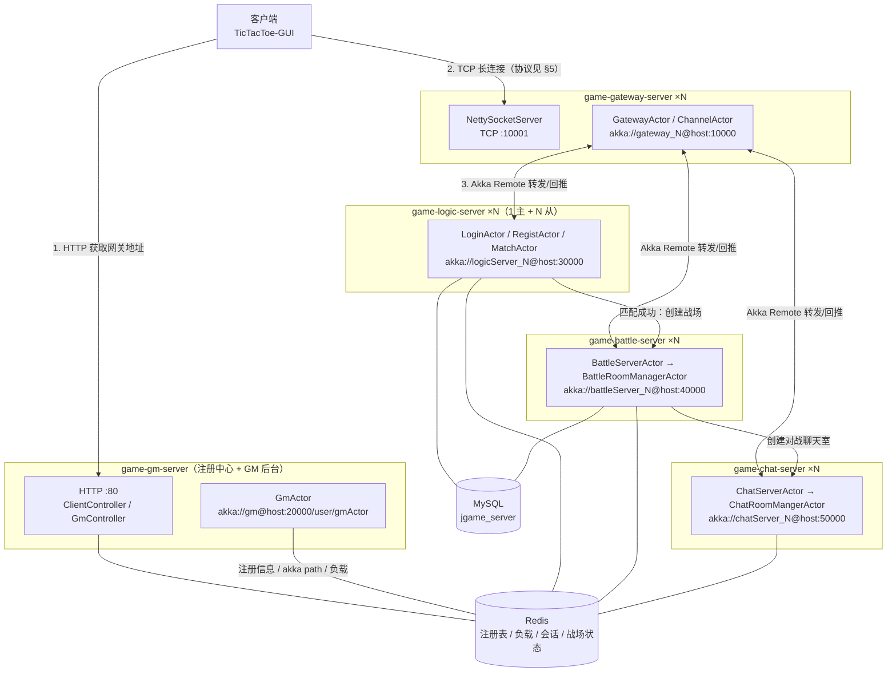

要点：

1. 客户端先 **HTTP 请求 GM 服务器** `/gateway` 接口，拿到一个空闲网关的连接地址（`ClientController.getLeisureGateway()`）。
2. 客户端与网关建立 **Netty 长连接**，连接由 gateway 维护；所有业务请求经网关以 **Akka Remote** 转发到后端业务服，响应沿原 `ResponseActor` 回推给客户端。
3. 各业务服启动时**向 GM 服务器注册**（自身 akka path 写入 Redis），GM 兼任注册中心；负载均衡数据也存 Redis，由各节点自行上报。

### 3.2 服务器角色一览

| 节点 | ActorSystem 命名 | 对客户端端口 | Akka Artery 端口 | 可否多实例 | 职责 |
|---|---|---|---|---|---|
| gm-server | `gm` | HTTP 80 | 20000 | 可（注册数据在 Redis） | 注册中心、网关地址分配、GM 账号/命令 |
| gateway-server | `gateway_{id}` | TCP 10001（`client.port`） | 10000 | 可（分布式） | 维护客户端连接、权限校验、协议路由转发 |
| logic-server | `logicServer_{id}` | - | 30000 | 可；**主逻辑服唯一** | 注册/登录/匹配；匹配只在主逻辑服运行 |
| battle-server | `battleServer_{id}` | - | 40000 | 可 | 战场创建、回合制对局逻辑（每局一个 Actor） |
| chat-server | `chatServer_{id}` | - | 50000 | 可 | 对战聊天室（每局一个房间 Actor） |

> 端口来源：各模块 `application.conf`（artery canonical.port）、`config.properties`（各 akka path / `client.port`）、gm 的 `application.yml`（`server.port: 80`）。

---

## 4. 工程模块划分

```
JGameServer
├── game-common            基础公共模块（消息载体、注解、Action 基类、Manager 骨架、proto3 生成类）
├── game-db                数据层（MySQL 实体/JPA、Redis DAO/Service、RedisKey 常量）
├── TicTacToe-GUI          测试客户端（Swing GUI，已纳入父 pom 聚合与统一管理）
├── game-gm-server         GM 服务器：注册中心 + HTTP 管理接口
├── game-gateway-server    网关服务器：Netty 接入 + 请求转发与权限控制
├── game-logic-server      逻辑服务器：登录注册、匹配
├── game-battle-server     对战服务器：战场与回合制对战逻辑
├── game-chat-server       聊天服务器：对战聊天室
└── doc/                   proto3 定义、SQL、工具、文档
```

### 4.1 模块依赖关系

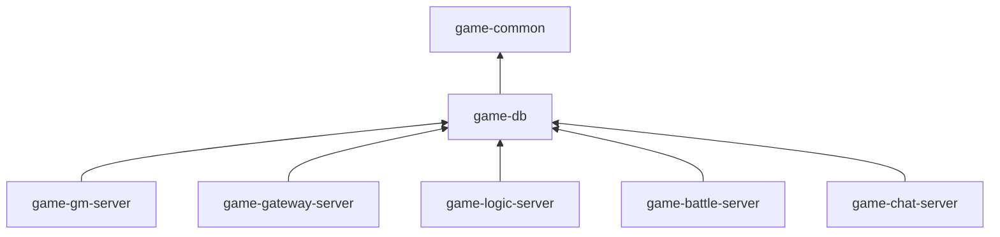

- **game-common**：
  - 消息体系：`IMessage`/`AbstractMessage` 及四种载体 `NetMessage`（客户端↔服务器）、`RemoteMessage`（服务器↔服务器）、`LocalMessage`（进程内）、`NetResponseMessage`（网关内部：ResponseActor → ChannelActor 的登录回包包装）；编解码器 `NetMessageSerializer`/`RemoteMessageSerializer` 供 Akka 远程序列化使用。
  - 扩展点：`BaseMessageAction`（模板方法 `LogRequest → doAction → LogResponse`）、注解 `@MessageClassMapping`（类级，声明处理的 rpcNum 与 isNet）、`@MessageMethodMapping`（方法级，可声明多个 rpcNum）。
  - 框架骨架：`IManager`/`CoreManager`（统一 init/shutdown）、`ClassScanner`（包扫描注解类）、`RpcErrorException`（业务异常携带 errorCode）。
- **game-db**：三类数据访问
  - `entity` + `repository`：JPA/MySQL（`PlayUserEntity`、`PlayStateEntity`、`GmUserEntity`、`BattleRecordEntity`）。
  - `dao`：纯 Redis 操作（各负载均衡 DAO、`SessionIdDAO`、`BattleInfoDAO`、`GmUserDAO`）。
  - `service`/`impl`：对上层的门面，各 Server 只依赖 service。
  - `redis/serializer`：`IntegerRedisSerializer`、`LongRedisSerializer`、`CommonRedisSerializer`（protobuf）等。
- **业务 Server**：各自包含 `config`（SpringConfig）、`manager`（ConfigManager/SpringManager/MessageManager/OnlineClientManager 等）、`actor`（Akka）、`action`（业务 Action，可选）、`service`（可选）。

---

## 5. 通信协议

### 5.1 客户端 ↔ 网关（Netty 自定义协议）

```
 ----------------消息协议格式---------------------
  packetLength | rpcNum | errorCode | body
     int          int       int       byte[]
```

| 字段 | 长度 | 说明 |
|---|---|---|
| packetLength | 4 字节 int | 整包总长（含头 12 字节），用于 TCP 拆包/粘包 |
| rpcNum | 4 字节 int | 协议号，见 `doc/proto3/rpc.proto` 的 `RpcNameEnum` |
| errorCode | 4 字节 int | 错误码 `RpcErrorCodeEnum`，请求包为 0 |
| body | n 字节 | protobuf 序列化的消息体（Lite 运行时） |

- 解码：`NettyProtocolDecoder`（`markReaderIndex` 半包处理，不足 `packetLength` 回滚等待）；编码：`NettyProtocolEncoder` → `NetMessage.toBinaryMsg()`。
- 管线：`Decoder → Encoder → IdleStateHandler(300s) → NettySocketHandle`。300 秒无读写触发 `userEventTriggered` 断开连接。
- 网关另实现了 `NettyWebSocketServer`（WebSocket 接入），当前 `ServerNodeManager` 仅启用 TCP 版 `NettySocketServer`。

### 5.2 协议号分段（rpc.proto）

| 分段 | 协议 | 处理节点 |
|---|---|---|
| 101~ | `Regist(101)`、`Login(102)` | Regist→主逻辑服，Login→任意逻辑服 |
| 111~ | `Match(111)`、`CancelMatch(112)` | 主逻辑服 |
| 6001~ | `GetBattleInfo`/`Concede`/`PlacePieces`/`ReadyToStartGame` | battle 服务器 |
| 10001~ | `JoinChatRoom`、`BattleChatText` | chat 服务器 |
| 20001~ | 服务器推送：`ForceOfflinePush(20001)`、`MatchResultPush(21001)`、`BattleEventMsgListPush(22001)`、`BattleChatTextPush(23001)` | 逻辑/对战/聊天服 → 客户端 |

### 5.3 服务器间协议（remote_server.proto）与内部协议（local_server.proto）

| 协议号 | 名称 | 方向 |
|---|---|---|
| 410101 | `RemoteRpcNoticeBattleServerCreateNewBattle` | 主逻辑服 → battle（创建战场），battle → 主逻辑服（响应） |
| 420101 | `RemoteRpcNoticeChatServerCreateNewBattleChatRoom` | battle → chat（创建聊天室） |
| 500001 | `RemoteRpcGatewayNoticeClientOfflinePush` | gateway → logic/battle/chat（客户端离线通知） |
| 500002 | `RemoteRpcLogicServerNoticeGatewayForceOfflineClient` | logic → gateway（顶号强制下线） |
| 310001 | `LocalRpcLogicServerMatch` | MatchActor 自循环：每秒匹配计算 |
| 320001 | `LocalRpcBattleServerInitBattle` | BattleRoomManagerActor → BaseBattleActor：初始化战场 |

### 5.4 Akka 序列化

各模块 `application.conf`：

```hocon
actor {
  provider = "akka.remote.RemoteActorRefProvider"
  allow-java-serialization = off
  serializers {
    net    = "com.jacey.game.common.msg.serializer.NetMessageSerializer"
    remote = "com.jacey.game.common.msg.serializer.RemoteMessageSerializer"
  }
  serialization-bindings {
    "com.jacey.game.common.msg.NetMessage"    = net
    "com.jacey.game.common.msg.RemoteMessage" = remote
  }
}
```

即跨节点只传输两类消息（内部仍是 12 字节头 + protobuf body），禁用了 Java 原生序列化。

---

## 6. RPC 分发框架（注解驱动）

这是全项目的核心扩展机制：**新增一个业务协议 = 写一个 Action 类或 Actor 方法 + 在 proto 里定义协议号**，框架自动完成路由。

### 6.1 注册过程

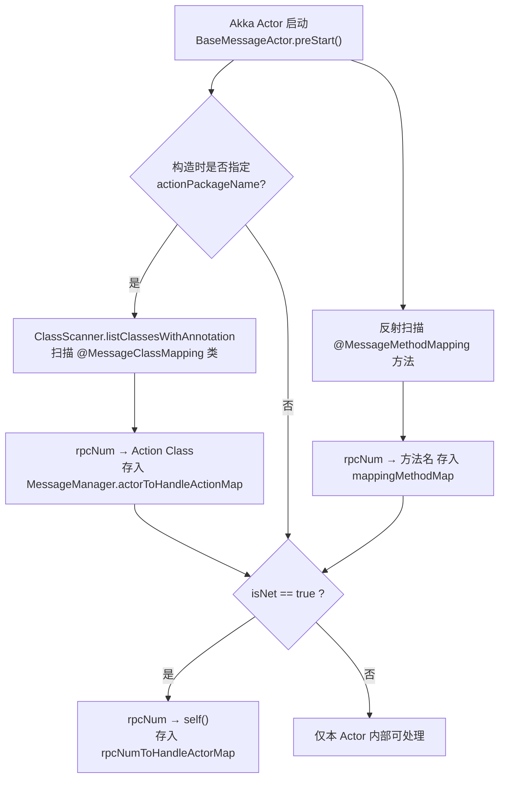

- `isNet=true` 表示该协议可从网关远程到达；`isNet=false` 的 Action 只能被本进程内 Actor 调用（如 battle 的 `PlacePiecesAction`，由 `BattleRoomManagerActor` 二次分发调用）。
- 同一 rpcNum 被重复注册会打 error 日志（首个注册生效）。

### 6.2 处理过程（`BaseMessageActor.onReceive`）

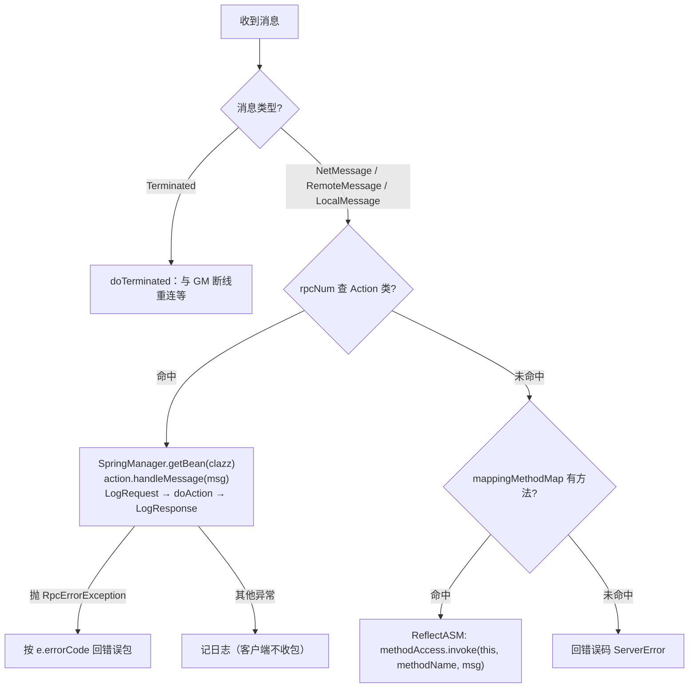

逻辑服的顶层分发：`LogicServerActor` 收到 `NetMessage` 后调 `MessageManager.handleRequest()`，按 `rpcNumToHandleActorMap` 把消息投递给对应的业务 Actor（LoginActor / RegistActor / MatchActor），再由 6.2 的机制落到 Action。

---

## 7. 服务器注册与发现（Nacos）

无 GM 注册流程。各节点启动时把自身（akka artery 地址、actorPath、对外端口、connectPath、isMainLogicServer）注册为 Nacos 临时实例；节点间通信时按 `NodeKind` + `nodeId` 从 Nacos 目录取 ActorRef（`NacosService.getActorRefByNodeKindAndNodeId` / `getRandomActorRefByNodeKind`）。

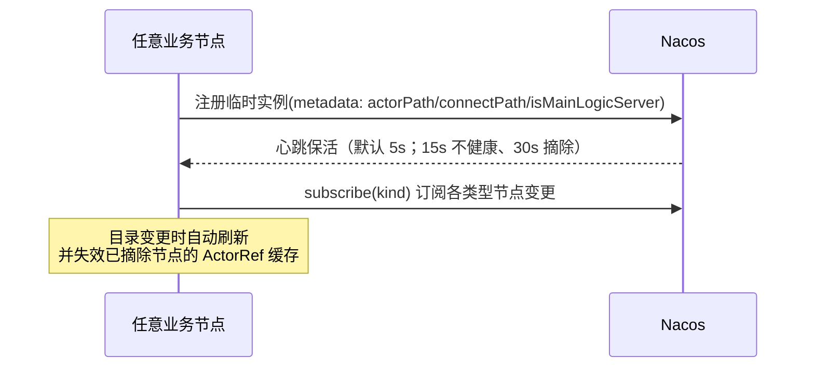

关键实现：

- `NacosService.start()`：注册临时实例（含 metadata），进程退出自动注销；主逻辑服用 `isMainLogicServer` metadata 标记，网关 `mainLogicServerId()` 按标记取（不再"取第一个"）。
- 存活感知：Nacos 临时实例心跳替代原 GM watch/Terminated + 5 秒重连注册循环；`Exit.exit(0)` 自杀逻辑一并移除（GM 下线只影响新客户端拿入口地址，不影响存量连接）。
- 网关入口下发：gateway 注册时带 `connectPath` metadata，GM 的 `GET /gateway` 直接从 Nacos 目录读，不再经 Redis。

---

## 8. 网关层设计

### 8.1 连接与 Actor 绑定

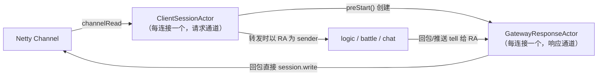

- 每个连接绑定一个 `ClientSessionActor`（请求通道）与附属 `GatewayResponseActor`（响应通道）：后端回包以 RA 为 sender，**绝不会回流进请求通道**——否则响应会被当作新客户端请求再次转发，形成 gateway ↔ backend 死循环（2026-09 修复）。
- `ClientSessionActor` 内嵌 `userId`：**登录成功后（由 RA 收到 Login 成功响应）才绑定**；未登录连接发匹配/对战/聊天协议会被直接 `channel.close()`。
- 网关本地错误（服务不可用、不在对局等）直接 `session.write` 回客户端，不经 actor 间转发。

### 8.2 请求路由表（`ChannelActor.onReceive` / gateway `MessageManager`）

| 协议 | 前置校验 | 路由目标 |
|---|---|---|
| Regist | 未登录才可 | **主逻辑服**（`sendNetMsgToMainLogicServer`） |
| Login | 未登录才可 | sessionId 绑定的逻辑服，无绑定则**最空闲**逻辑服（`sendNetMsgToLogicServer`） |
| Match / CancelMatch | 已登录 | 主逻辑服 |
| GetBattleInfo / Concede / PlacePieces / ReadyToStartGame | 已登录且 `battleUserIdToBattleId` 存在 | `battleId → battleServerId → akkaPath`；服务器失效则回落最空闲 battle 服 |
| JoinChatRoom / BattleChatText | 已登录且在对战中 | `battleId → chatServerId → akkaPath` |

负载依据全部来自 Redis zset（score = 当前负载，value = serverId），`getLeisureXxxId()` 取 score 最小者。

### 8.3 服务端推送通道

业务服需要主动推送时（匹配结果、战斗事件、聊天、强制下线）：`userId → sessionId`（Redis）→ `OnlineClientManager` 中 sessionId → 该连接的 `ResponseActor` → 客户端。见 logic `MessageManager.sendNetMsgToOneUser()`。

---

## 9. 核心业务流程

### 9.1 客户端接入与登录（含顶号）

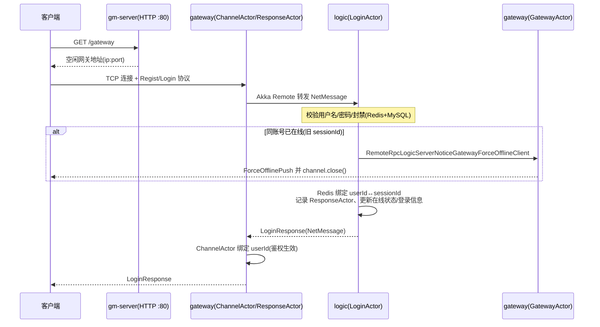

登录实现见 `LoginActor.doLoginActor()`：①参数非空 ②用户存在 ③密码 MD5 ④封禁检查（过期自动清除）⑤顶号 ⑥会话绑定 ⑦ResponseActor 登记 ⑧在线状态 ⑨更新登录时间/IP ⑩响应。

### 9.2 匹配与创建战场（主逻辑服 → battle 服）

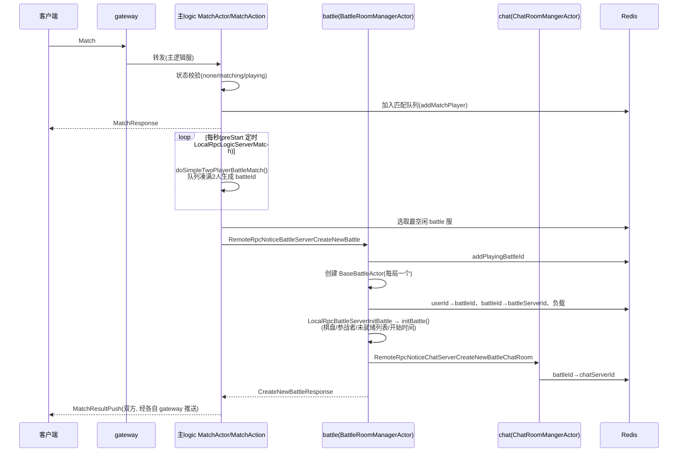

- 匹配只在**主逻辑服**运行（`is.main.logic.server=true`），`MatchActor` 用「每秒给自己发一条 LocalMessage」实现自循环调度。
- `BaseBattleActor.initBattle()` 完成战场 Redis 初始化后立即通知 chat 建房，聊天与对战同步就绪。

### 9.3 对战操作与事件系统

客户端对战协议（落子等）由 `BattleRoomManagerActor.proxyNetMessageInvoke()` 按 `userId → battleId → BaseBattleActor` 二次分发；若本机找不到该局 Actor（如原 battle 服下线后流量切到新节点），会依据 Redis 中的对局信息**重建 BaseBattleActor**，实现战斗可迁移。

对局逻辑在 `BattleEventServiceImpl` 中以**事件链**驱动：

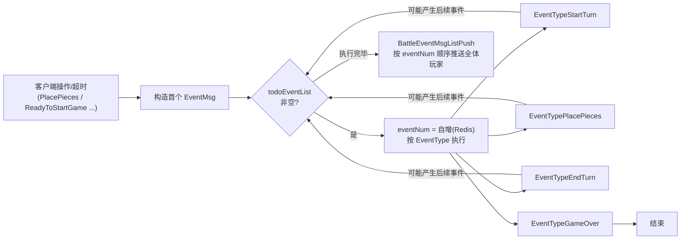

- 每个事件分配自增 `eventNum`（Redis 键），推送携带序号；客户端请求需带 `lastEventNum`，不一致返回 `InputLastEventNumError`（14）——这是**丢包检测/重同步**机制。
- 战局结束写 MySQL `battle_record`，并清理 Redis 对战映射。

### 9.4 对战聊天

`BaseBattleChatRoomActor.battleChatText()`：`userId → battleId`（Redis）→ 取对手 userId → 构造 `BattleChatTextPush` 推送给对方（1v1 场景），同时回发送者 `BattleChatTextSendResponse`。`JoinChatRoom` 目前直接回成功。

### 9.5 断线处理

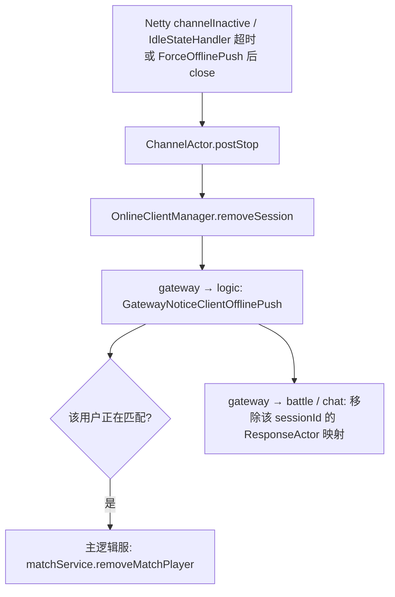

推送目标（logic/battle/chat）由 Redis 中该 sessionId 的归属记录决定。

---

## 10. Actor 拓扑（各进程内）

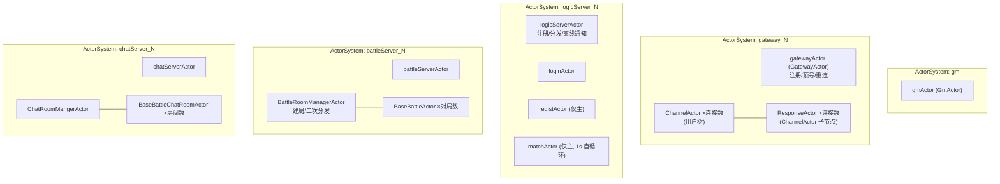

命名规范：系统名 `{前缀}{id}`，顶层业务 Actor 名固定（`GlobalConstant`），跨服寻址用完整 akka path（注册时写入 Redis）。

---

## 11. 数据层设计

### 11.1 MySQL（`doc/sql/jgame_server.sql`，库名 `jgame_server`）

| 表 | 用途 | 关键字段 |
|---|---|---|
| `play_user` | 玩家账号 | user_id, username, nickname, passwordMD5, regist/last_login 时间与 IP |
| `play_state` | 玩家状态 | user_online_state, user_action_state(none/匹配中/对战中), battle_type, battle_id |
| `play_forbid` | 封禁记录 | user_id, forbid_reason, 起止时间 |
| `battle_record` | 对局记录 | battle_type, battle_id, user_id_list, 起止时间, turn_count, winner_user_id, game_over_reason |
| `gm_user` | GM 账号 | username, passwordMD5（内置 admin/admin） |

> 注意：玩家实时数据（`USER_DATA`、`USER_STATE`）以 protobuf 形式存 Redis，MySQL 主要落账号与战绩；`game-db` 的 repository 仅覆盖 `play_user/play_state/gm_user/battle_record` 四类。

### 11.2 Redis（`game-db/constants/RedisKeyConstant.java`）

| Key | 类型 | 内容 |
|---|---|---|
| `sessionIdAutoIncrease` / `userIdAutoIncrease` | value | 自增分配器 |
| `sessionIdToGatewayId` | hash | 客户端所在网关 |
| `sessionIdToLogicServerId` | hash | 客户端归属逻辑服 |
| `userIdToSessionId` / `sessionIdToUserId` | hash | 登录映射（顶号检测用） |
| `battleUserIdToBattleId` | hash | 对战中玩家 → 对局 |
| `battleIdToBattleServerId` | hash | 对局 → 承载的 battle 服 |
| `battleIdToChatServerId` | hash | 对局 → 聊天服 |
| `{logic,gateway,battle,chat}ServerLoadBalance` | zset | 负载表（score=负载） |
| `{logic,gateway,battle,chat}ServerIdToAkkaPath` | hash | 注册表（akka 寻址） |
| `gatewayIdToConnectPath` | hash | 网关客户端连接地址（`/gateway` 接口数据源） |
| `mainLogicServerId` | value | 主逻辑服 id |
| `userData` / `userState` / `usernameToId` | hash | 玩家实时数据 |
| BattleInfo 一族（`BattleRedisKeyHelper`） | 多类型 | 对局内棋盘、参战者、未就绪列表、当前回合、自增 eventNum、开始时间等 |

Redis 是本架构的**共享状态中枢**：无状态的业务服借此实现水平扩容与故障迁移。

---

## 12. 负载均衡与高可用

- **负载上报**：各节点连接 GM 后及负载变化时，把当前连接数/对局数写入自己的 zset 条目（如 gateway `OnlineClientManager.addSession` → `setOneGatewayLoadBalance`）。
- **选点策略**：`getLeisureXxxId()` = zset 中 score 最小的节点。
- **会话粘性**：登录时写入 `sessionIdToLogicServerId`，后续请求路由回同一逻辑服；没有记录或记录失效时自动选最空闲节点。
- **故障迁移**：
  - battle 服下线 → 玩家下一个对战请求被网关路由到其他 battle 服，该服按 Redis 战局数据重建 `BaseBattleActor`；
  - GM 下线 → 各节点检测 `Terminated` 后每 5 秒重试注册；GM 重启清空注册表，等待全网重新注册；
  - 网关本身可多实例，客户端通过 GM `/gateway` 接口拿到当前负载最低的入口。

---

## 13. 启动与配置

### 13.1 启动顺序

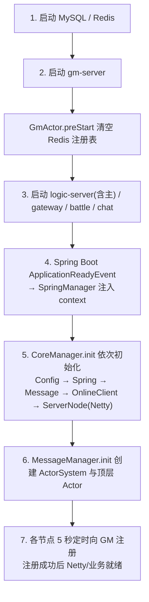

### 13.2 配置文件（各 Server 模块 `src/main/resources`）

| 文件 | 内容 |
|---|---|
| `config.properties` | 本节点 id、akka path、GM 的 akka path（`remote.gm.akka.path`）、gateway 的 `client.port`/`gateway.connect.path`、logic 的 `is.main.logic.server` |
| `application.yml` | MySQL 数据源（gm 另有 `server.port: 80`） |
| `application.conf` | Akka remote（artery 端口、序列化绑定） |

部署多实例时：修改各节点 `config.properties` 的 `*.server.id` 与本机 IP，保证 id 唯一；主逻辑服仅一台置 `is.main.logic.server=true`。

### 13.3 协议开发流程（新增协议）

1. 在 `doc/proto3/rpc.proto`（或 remote/local_server.proto）添加协议号与 message；
2. 用 `doc/tool/protoc-3.12.0-rc-2-win64.zip` 重新生成 `game-common` 的 proto3 类；
3. 编写 Action：`@MessageClassMapping(Rpc.RpcNameEnum.XXX)` + `@Component`，或在既有 Actor 方法上加 `@MessageMethodMapping`；
4. 网关无需改动即可转发（新协议需按 §8.2 在 `ChannelActor` 增加路由分支——当前版本路由表为显式 switch）。

---

## 14. 目录速查（源码入口）

| 内容 | 位置 |
|---|---|
| 消息载体与协议头 | `game-common/.../msg/NetMessage.java`、`RemoteMessage.java` |
| RPC 注解 | `game-common/.../annotation/MessageClassMapping.java`、`MessageMethodMapping.java` |
| 分发基类 | 各模块 `actor/BaseMessageActor.java`（logic 版最完整） |
| 网关编解码 | `game-gateway-server/.../network/netty/tcp/codec/` |
| 网关路由 | `game-gateway-server/.../actor/ChannelActor.java`、`manager/MessageManager.java` |
| 服务器注册 | 各服 `actor/XxxServerActor.preStart()` + gm `actor/GmActor.registServer()` |
| 登录/匹配 | logic `actor/LoginActor.java`、`service/impl/MatchServiceImpl.java` |
| 战场与事件 | battle `actor/BattleRoomManagerActor.java`、`service/impl/BattleEventServiceImpl.java` |
| 聊天 | chat `actor/BaseBattleChatRoomActor.java` |
| Redis Key 总表 | `game-db/.../constants/RedisKeyConstant.java` |
| proto 定义 | `doc/proto3/*.proto` |
| 建库 SQL | `doc/sql/jgame_server.sql` |

---

## 15. 已知限制与演进方向（README TODO）

- 无独立登录服、无独立注册中心（GM 兼任）；GM 后台无 Web 界面（`executeGmCmd` 为 TODO）。
- 事件驱动模型尚在演进（README TODO）；聊天室 `JoinChatRoom` 未做房间级校验。
- 协议安全：`passwordMD5` 直接比对，封禁/权限体系较简单；网关路由表为硬编码 switch，新协议需改网关。
- JDK 要求 1.8（README Tips；当前 `pom.xml` 已锁定 `java.version=1.8`）。
